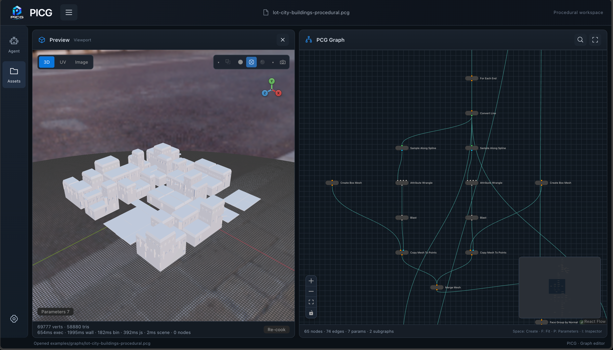
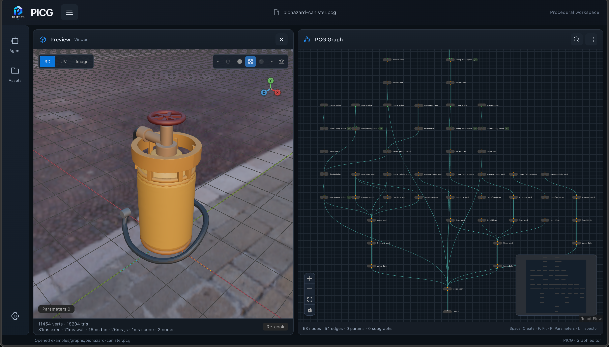
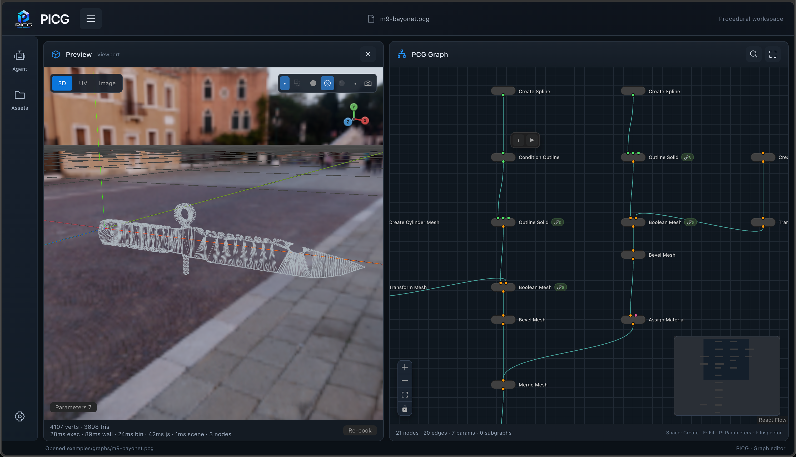
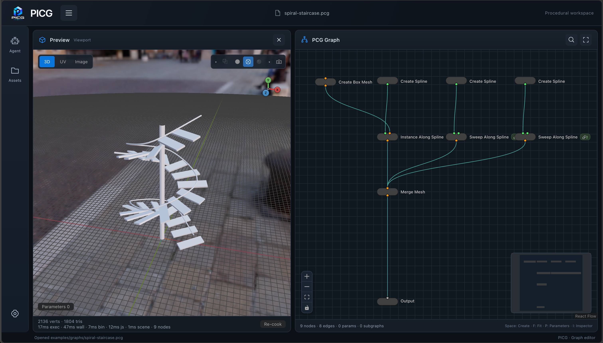
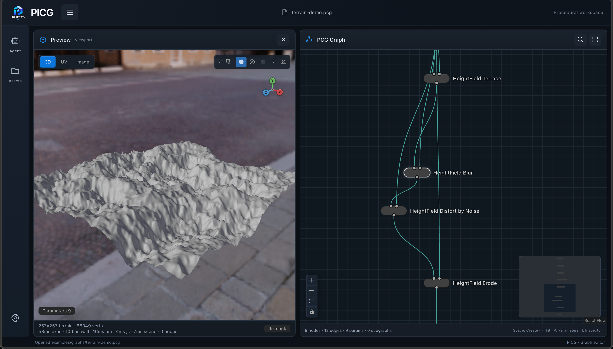
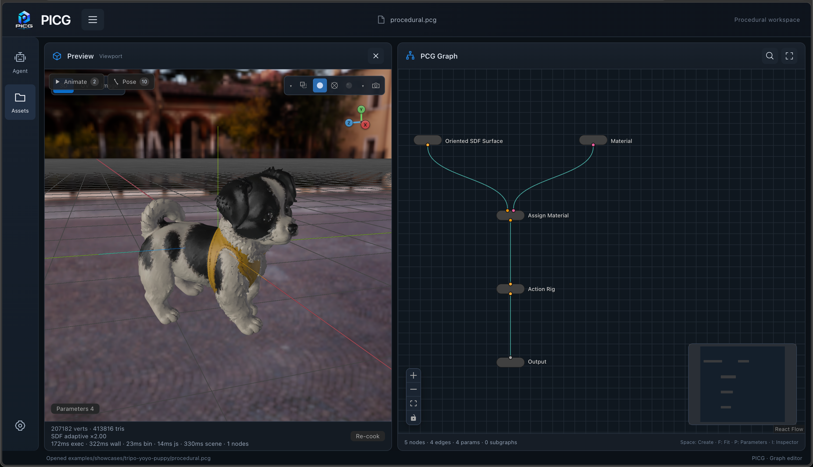
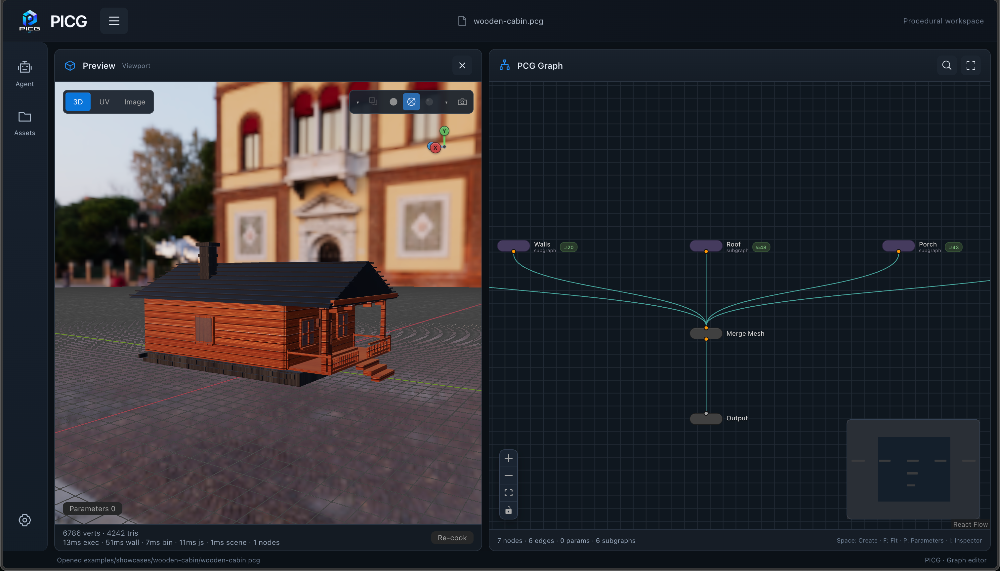

<p align="right">
  <strong>English</strong> | <a href="README.ja.md">日本語</a>
</p>

<p align="center">
  
</p>

<h1 align="center">PICG</h1>

<p align="center">
  <strong>One editable PCG graph. From image to game-ready asset. Across engines.</strong>
</p>

<p align="center">
  An AI-native procedural content framework for building reusable assets in the Web editor,<br>
  bringing them into Unity today, and targeting Unreal, Blender, Godot, and Three.js next.
</p>

<p align="center">
  <a href="LICENSE"></a>
  
  
  
</p>

PICG (Procedural Intelligent Content Generation) treats the `.pcg` file as the portable source of truth for an asset. Author it visually, ask an AI agent to build it through MCP, or start from an image with Meshy/Tripo assistance—then keep the result editable, reproducible, and ready for engine integration.

> **Project status:** active development. Web authoring and Unity integration are available now. Other host integrations listed below are planned, and graph schemas and APIs may still change before a stable release.

## Showcase

Each example below is an editable graph shown beside its live Web preview—not a one-off baked render.

| Example | Preview | What it demonstrates |
| --- | --- | --- |
| [Lot city buildings](examples/graphs/lot-city-buildings-procedural.pcg) |  | Buildings derived from lots, roads, and reusable assembly logic. |
| [Biohazard canister](examples/graphs/biohazard-canister.pcg) |  | Hard-surface construction with splines, primitives, bevels, transforms, and merge stages. |
| [M9 bayonet](examples/graphs/m9-bayonet.pcg) |  | Outline solids, Boolean cuts, bevels, UVs, and material assignment. |
| [Spiral staircase](examples/graphs/spiral-staircase.pcg) |  | Spline-driven construction with sweep and instancing operations. |
| [Terrain demo](examples/graphs/terrain-demo.pcg) |  | Heightfield terracing, blur, noise distortion, and erosion. |
| [Tripo YoYo puppy](examples/showcases/tripo-yoyo-puppy/procedural.pcg) |  | A Tripo-assisted reference workflow refined into procedural surfacing, materials, semantic components, and an action rig. |
| [Wooden cabin](examples/showcases/wooden-cabin/wooden-cabin.pcg) |  | Reusable wall, roof, and porch subgraphs assembled into a finished building. |

More graphs, fixtures, and case studies live under [examples/](examples/README.md).

## One graph, multiple platforms

PICG separates the graph contract and C++ execution semantics from each host's editor, renderer, scene objects, and runtime bindings. The goal is simple: create an asset once, keep one procedural `.pcg` source, and use it wherever the scene lives.

| Platform | Status | Integration direction |
| --- | --- | --- |
| **Web editor** | **Available** | Visual graph authoring, live Three.js preview, review captures, Agent window, GLB export |
| **Unity** | **Available** | Graph editor, Scene view workflow, FBX/GLB output, materials, splines, Terrain, GPU instancing, and runtime components |
| **Unreal Engine** | **Planned** | Native editor and scene integration backed by the same graph and host-data contracts |
| **Blender** | **Planned** | DCC authoring, procedural iteration, and interchange without rewriting asset logic |
| **Godot** | **Planned** | Editor and runtime host adapter for the shared graph format |
| **Three.js runtime** | **Planned** | Reusable runtime package beyond the Three.js preview already used by the Web editor |

Host-specific bindings stay outside the portable graph. A Unity material, a future Unreal material, or a scene-specific terrain reference can differ while the asset's procedural intent, parameters, seeds, and geometry stages remain shared.

## From image to engine

PICG is designed around the complete asset journey rather than stopping at a generated mesh:

```text
Image / prompt / design brief
            │
            ├── AI Agent through MCP
            ├── Built-in Agent window + your AI provider
            └── Meshy / Tripo assisted generation
                         │
                         ▼
                Editable .pcg graph
        geometry · UVs · materials · hierarchy
        parameters · seeds · rig/runtime metadata
                         │
                         ▼
              Validate → Cook → Review
                         │
             ┌───────────┴───────────┐
             ▼                       ▼
       Web / GLB export       Engine integration
                              editor + runtime
```

The target is a **game-ready asset pipeline**: reproducible geometry, engine-usable materials and UVs, meaningful components, and—when the asset requires them—rig, animation, collider, or host-binding data. Generated output remains a starting point that can be measured, refined, validated, and regenerated from the graph.

## AI can create the asset, not just suggest it

### MCP-first graph authoring

`pcg-server` exposes a Streamable HTTP MCP endpoint at `http://127.0.0.1:17890/mcp`. MCP clients such as Codex, Cursor, or OpenCode can inspect the live editor, discover node definitions from the manifest, create and wire nodes, edit parameters, validate, cook, capture the viewport, and save the graph.

The AI works against the same open graph you see—not a detached text mock-up. Graph-hash locking, atomic operations, validation, and visual capture make iterative asset creation practical and reviewable.

```json
{
  "mcpServers": {
    "picg": {
      "url": "http://127.0.0.1:17890/mcp"
    }
  }
}
```

See [External Agent MCP](docs/pcg-server.md#external-agent-mcp) for the tool surface and authoring loop.

### Built-in Agent window

The Web editor also includes its own Agent workspace. Connect a supported provider in **Settings → AI Providers**, choose a tool-capable model, attach images or `.pcg` files, and create directly beside the graph and live viewport.

The local Agent runtime supports OpenAI Responses, Anthropic Messages, Gemini `generateContent`, Kimi for Coding, and OpenAI-compatible Chat Completions. It includes durable local chat history, streaming tool calls, explicit approval for graph writes, retry/cancel controls, and protected local credential storage.

### Meshy and Tripo as procedural collaborators

PICG can bring cloud generation into the graph without making an opaque generated mesh the end of the workflow:

- **Meshy** nodes cover image-to-3D, text-to-3D, remesh/resize/UV unwrap, retexturing, and image generation in the Unity integration.
- **Tripo** image-to-3D is available in both the Web and Unity workflows, including cached generation and an assisted Web path for turning a reference result into editable procedural stages.
- Cloud calls are explicit and cached. Normal cook, preview, and graph editing reuse local results instead of silently spending API credits.
- API keys stay in local protected storage or engine preferences; they are never written into `.pcg` files.

This makes Meshy and Tripo useful for ideation, reference reconstruction, topology/material operations, or visual targets while PICG owns the repeatable graph, downstream processing, validation, and engine delivery. See [Third-party image-to-3D](docs/third-party-image-to-3d.md).

## Engine-native and runtime-ready by design

PICG integrations are intended to go deeper than file export. A host adapter can provide engine scene data as graph inputs and apply cooked results back to native engine objects.

Unity already demonstrates this direction with graph assets and inspectors, Scene view previews, material bindings, spline inputs, Terrain read/write, GPU-instanced scatter, and `PcgRuntimeRunner` for Player-side graph execution. The current Player path uses a same-machine `pcg-server` sidecar; it is not yet a self-contained offline runtime. See [Unity runtime](docs/Tutorials/07-unity-runtime.md) for the exact deployment boundary.

Future Unreal, Blender, Godot, and Three.js adapters are expected to reuse the same versioned graph and native execution core while implementing their own scene bindings, materials, asset import, and runtime lifecycle.

## Core capabilities

- **Portable graph contract** — editable, diffable, versioned `.pcg` files shared by authoring tools and host integrations.
- **Native procedural core** — C++17 geometry and graph execution with deterministic parameters and seeds.
- **Production graph building blocks** — primitives, splines, scattering, terrain/heightfields, Boolean and bevel workflows, materials, subgraphs, imports, assembly, and rig metadata.
- **Web authoring and review** — React Flow graph editing, Three.js preview, diagnostic capture modes, animation controls, and full-quality GLB export.
- **Unity integration** — editor and runtime components using the same graph contract and external native cook service.
- **Agent-native workflow** — MCP plus an embedded multi-provider Agent that can operate the live graph and viewport.
- **Reference-assisted creation** — image inputs and Meshy/Tripo nodes can feed a procedural, engine-oriented finishing workflow.

## Quick start

### Prerequisites

- Node.js `^20.19.0` or `>=22.12.0`
- CMake 3.20+
- A C++17 compiler
- libcurl development files where CMake does not provide them automatically
- Optional: Unity 2022.3 or Unity 1.6.x for the Unity project

Clone the repository and initialize its submodule:

```bash
git clone --recurse-submodules https://github.com/DJ-Huang/PICG.git
cd PICG
```

On macOS or Linux, start the native server and Web editor together:

```bash
./scripts/run-pcg-web.sh
```

This builds missing native artifacts, installs missing Web dependencies, and starts:

- Web editor: `http://127.0.0.1:5173`
- Health endpoint: `http://127.0.0.1:17890/v1/health`
- MCP endpoint: `http://127.0.0.1:17890/mcp`

Windows users can build and run the server with:

```powershell
.\scripts\build-pcg-server.ps1 -Run
cd web\pcg-editor
npm ci
npm run dev
```

See [Getting Started](docs/getting-started.md) for separate-process commands and the complete Unity workflow.

## Architecture

```text
 Manual graph editing       Built-in Agent        External MCP clients
          │                       │                        │
          └───────────────────────┼────────────────────────┘
                                  ▼
                      Versioned .pcg graph contract
                                  │
                                  ▼
                             pcg-server
                    cook · MCP · Agent · cache · export
                                  │
                                  ▼
                         pcg-core (C++17)
                                  │
              geometry · points · splines · materials · metadata
                                  │
             ┌────────────────────┴────────────────────┐
             ▼                                         ▼
     Web / Three.js preview                    Engine host adapters
          + GLB export                     Unity now · more planned
```

The C++ runtime is the execution source of truth. Editors and engines act as interchangeable authoring and host layers around the same graph semantics. Read [Architecture](docs/architecture.md) for the protocol and ownership boundaries.

## Repository layout

```text
PICG/
├── .agents/               Agent skills and procedural asset workflows
├── docs/                  User, architecture, runtime, and integration guides
├── examples/              Graphs, tests, subgraphs, showcases, and storyboards
├── library/               Canonical built-in subgraph library
├── pcg-core/              C++ graph runtime and geometry algorithms
├── pcg-fbx-exporter/      Standalone FBX export library
├── pcg-server/            Local HTTP/MCP cook, Agent, cache, and export backend
├── schema/                Versioned graph schemas and node manifest
├── scripts/               Build, run, sync, and validation commands
├── Unity/                 Unity editor and runtime integration
└── web/pcg-editor/        Vite + React graph editor and Three.js viewport
```

## Build and validation

```bash
# Native core and tests
./scripts/build-pcg-core.sh --run-tests

# Repository contracts
python3 scripts/validate-manifest.py
python3 scripts/validate-subgraph-schema.py
python3 scripts/validate-builtin-library.py
python3 scripts/check-doc-language.py

# Server smoke test (with pcg-server running)
./scripts/verify-pcg-server.sh
```

```bash
# Web editor
cd web/pcg-editor
npm ci
npm run lint
npm run build
npx vitest run
```

The complete script catalog is documented in [scripts/README.md](scripts/README.md).

## Documentation

- [Getting Started](docs/getting-started.md)
- [Architecture](docs/architecture.md)
- [PCG server, embedded Agent, and MCP](docs/pcg-server.md)
- [Third-party image-to-3D](docs/third-party-image-to-3d.md)
- [Node reference](docs/node-reference.md)
- [Unity project](Unity/README.md)
- [Subgraph library](library/README.md)
- [Roadmap](ROADMAP.md)
- [Changelog](CHANGELOG.md)
- [Maintainer workflows](docs/maintainer-workflows.md)

## Contributing and security

Read [CONTRIBUTING.md](CONTRIBUTING.md) before opening a pull request and [SECURITY.md](SECURITY.md) before reporting a vulnerability. Community expectations are described in [CODE_OF_CONDUCT.md](CODE_OF_CONDUCT.md), project decisions in [GOVERNANCE.md](GOVERNANCE.md), and support boundaries in [SUPPORT.md](SUPPORT.md).

## License

PICG is licensed under the [Apache License 2.0](LICENSE).
