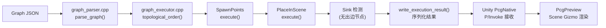

# 项目总览：先建立全局心智模型

> [返回目录](index.md) | 基于 commit `f50d744`

## 学习目标
读完后，你能够：
- 用自己的话描述 PCG-AI 的系统边界和最小执行闭环
- 从公开入口追踪到最终输出
- 说明各核心模块的依赖方向和数据流方向

## 1. 先看一次完整运行

PCG-AI 的核心是一条 **Web 画布编辑 → Graph JSON → C++ 执行 → Unity 预览** 的数据管线。

最简操作：

1. **Web 编辑器**（`web/pcg-editor/`）：`npm run dev` → 浏览器打开 `localhost:5173` → 调整节点参数 → 点击 **Send to Unity**
2. **C++ 核心**（`pcg-core/`）：接收 Graph JSON → 拓扑排序 → 逐节点执行 → 输出 Mesh/Points/Geometry 二进制
3. **Unity 预览**（`Unity/Assets/PcgPlugin/`）：P/Invoke 调用 C++ → 解析二进制结果 → Scene 视图渲染 Gizmo/Mesh

或者，直接在 Unity 内使用 **GraphView 编辑器**（`PCG → Graph Editor`）编辑图，无需 Web。

最简验证命令：

```powershell
# 验证 C++ 核心已就绪（M0 里程碑）
# Unity 菜单：PCG → Print PcgCore Version
# Console 应输出：pcg-core 0.1.1 (bmesh-tier1)
```

证据：E-001。

## 2. 系统边界

**在系统内**：

| 组件 | 职责 | 技术栈 |
|------|------|--------|
| **pcg-core** | 唯一算法执行体：图解析、拓扑排序、节点执行、几何计算、二进制序列化 | C++17, CMake, nlohmann/json |
| **Unity PcgPlugin** | 引擎绑定：P/Invoke、结果解析、Scene 预览、GraphView 编辑器 | C#, Unity 2022.3+ |
| **Web pcg-editor** | 轻量图编辑器：React Flow 画布、导出 JSON | TypeScript, Vite, @xyflow/react |
| **Schema** | 数据契约：Graph JSON 定义 + Node Manifest（SSOT） | JSON Schema |

**在系统外**：

- Unreal Engine — 不依赖，但节点模型对齐 UE PCG（Settings/Element/Context/DataCollection）
- Blender — 不依赖，但 BMesh 数据结构对齐 Blender 的半边网格
- 第三方库 — CDT（Constrained Delaunay Triangulation），作为 git submodule 引入

**设计哲学**（证据：E-003, D-003）：

> 不自研 Block 注册表框架，直接对齐 UE PCG 节点模型；不引入 UE 引擎依赖（无 UObject），仅在独立 C++ 库中复刻数据流与节点语义。C++ 是唯一算法执行体；各端负责 UI 与引擎绑定。

## 3. 最小闭环

最小可运行图只需两个节点 + 一条边：

```json
{
  "version": "1.0",
  "nodes": [
    { "id": "n2", "type": "SpawnPoints", "data": { "count": 100, "radius": 10.0 } },
    { "id": "n3", "type": "PlaceInScene", "data": { "prefab": "", "scale": 1.0 } }
  ],
  "edges": [
    { "id": "e1", "source": "n2", "target": "n3", "sourceHandle": "out", "targetHandle": "in" }
  ]
}
```

来源：`schema/example.pcg`，commit `f50d744`。

执行路径：



关键符号追踪（证据：E-004, E-008, E-012）：

1. `pcg_execute_graph_v8()` — C API 入口（`pcg_core.cpp`）
2. `parse_graph()` — JSON → `Graph` 结构（`graph_parser.cpp`）
3. `topological_order()` — Kahn 算法拓扑排序（`graph_executor.cpp`）
4. `SpawnPointsElement::execute()` — 生成 100 个随机点（`element_registry.cpp`）
5. `PlaceInSceneElement::execute()` — 包装点数据 + prefab 信息（`element_registry.cpp`）
6. `write_execution_result()` — 序列化为 JSON/二进制（`pcg_core.cpp`）

## 4. 仓库地图

| 路径 | 职责 | 何时阅读 |
|------|------|----------|
| `pcg-core/include/pcg_api.h` | 对外 C API 唯一头文件 | [02 C API 层](02-c-api-layer.md) |
| `pcg-core/src/pcg_core.cpp` | C API 实现、结果序列化 | [02 C API 层](02-c-api-layer.md) |
| `pcg-core/src/graph_executor.cpp` | 拓扑排序、逐节点执行、Sink 检测 | [03 图执行引擎](03-graph-executor.md) |
| `pcg-core/src/graph_parser.cpp` | Graph JSON 解析 | [01 Graph JSON](01-graph-json-and-schema.md) |
| `pcg-core/src/data/` | 数据模型（Geometry/Mesh/Point/Spline/Texture） | [04 数据模型](04-data-model.md) |
| `pcg-core/src/elements/` | 节点实现（Element + Algorithm 配对） | [05 节点系统](05-element-system.md) |
| `pcg-core/src/geometry/` | 几何内核（BMesh/Sweep/Boolean/BVH） | [06 几何内核](06-geometry-kernel.md) |
| `pcg-core/src/cook_hash.cpp` | Cook Cache 哈希计算 | [03 图执行引擎](03-graph-executor.md) |
| `pcg-core/src/graph_cook_cache.cpp` | per-node 输入哈希缓存 | [03 图执行引擎](03-graph-executor.md) |
| `schema/node-manifest.json` | 节点 Pin/参数定义（SSOT） | [01 Graph JSON](01-graph-json-and-schema.md) |
| `schema/graph-schema-v2.json` | JSON Schema v2 | [01 Graph JSON](01-graph-json-and-schema.md) |
| `Unity/.../Runtime/PcgNative.cs` | P/Invoke 绑定 | [07 Unity 运行时](07-unity-runtime.md) |
| `Unity/.../Runtime/PcgResultParser.cs` | 二进制结果解析 | [07 Unity 运行时](07-unity-runtime.md) |
| `Unity/.../Runtime/PcgGraphComponent.cs` | MonoBehaviour 生命周期管理 | [07 Unity 运行时](07-unity-runtime.md) |
| `Unity/.../Editor/Graph/PcgGraphEditorWindow.cs` | GraphView 编辑器窗口 | [08 Unity 编辑器](08-unity-graph-editor.md) |
| `Unity/.../Editor/Graph/PcgGraphView.cs` | 画布交互（拖拽/连线/选择） | [08 Unity 编辑器](08-unity-graph-editor.md) |
| `web/pcg-editor/src/` | Web 编辑器源码 | [09 端到端](09-end-to-end-debug.md) |
| `scripts/build-pcg-core.ps1` | 一键构建+拷贝+测试 | [09 端到端](09-end-to-end-debug.md) |

## 5. 核心概念

| 概念 | 精确定义 | 不要混淆 | 证据 |
|------|----------|----------|------|
| **Graph JSON** | 描述节点和边的 JSON 文档，版本化（`version` 字段） | 不是 JSON Schema——Schema 验证 Graph JSON 的格式 | E-035 |
| **Node Manifest** | 定义每种节点类型的输入/输出 Pin 和参数的 JSON 文件 | 不是 Graph JSON——Manifest 描述节点类型，Graph JSON 描述具体图实例 | E-036 |
| **Element** | 实现 `IPcgElement` 接口的类，负责一个节点类型的执行逻辑 | 不是 Algorithm——Element 处理 IO 和注册，Algorithm 负责计算 | E-023, E-026 |
| **PcgDataCollection** | 节点的输入/输出总线，可同时持有 points/mesh/geometry/spline/json | 不是单一类型容器——一个 collection 可包含多个 tagged 数据项 | E-016 |
| **PcgGeometry** | n-gon 几何体（点 + 面 + 组 + 细节），延迟三角化 | 不是 PcgMeshData——MeshData 是已三角化的网格，Geometry 保留原始面拓扑 | E-017 |
| **Cook Cache** | per-node 输入哈希缓存，输入未变时跳过执行 | 不是全局缓存——结构变化时整体 clear，但单节点输入不变时命中 | E-011 |
| **Sink** | 图中无出边的节点，执行结果的来源 | 不是最后一个执行的节点——拓扑排序中可能有多个无出边节点，优先选 type=="Output" | E-012 |
| **BMesh** | Blender 风格半边网格数据结构，用于 bevel/boolean 内部计算 | 不是 PcgMeshData——BMesh 是内部计算结构，MeshData 是输出格式 | E-029 |

## 6. 一次调用追踪

以 `pcg_execute_graph_v8()` 为例，追踪从 API 调用到结果输出的完整路径：

**Step 1: 验证与解析**（证据：E-004）

```
pcg_execute_graph_v8(json, seed, ...)
  → execute_graph_cached(...)
    → pcg_validate_graph(json, ...)     // 结构验证
    → parse_graph(json, graph, ...)    // JSON → Graph{nodes, edges}
```

`Graph` 结构定义（`internal/graph_types.hpp`）：

```cpp
struct GraphNode {
    std::string id;
    std::string type;
    nlohmann::json data;
};

struct GraphEdge {
    std::string id;
    std::string source;
    std::string target;
    std::string source_handle = "out";
    std::string target_handle = "in";
};

struct Graph {
    std::string version;
    std::vector<GraphNode> nodes;
    std::vector<GraphEdge> edges;
};
```

来源：`pcg-core/src/internal/graph_types.hpp`，commit `f50d744`。证据：E-035。

**Step 2: 构建运行时上下文**（证据：E-004）

```
    → build_texture_runtime(textures, ...)   // 上传纹理到 TextureRuntime
    → build_mesh_runtime(meshes, ...)         // 上传网格到 MeshRuntime
    → build_spline_runtime(splines, ...)      // 上传样条线到 SplineRuntime
```

**Step 3: 图执行**（证据：E-008, E-009, E-010, E-011, E-012）

```
    → execute_graph(graph, seed, result, ...)
      → register_builtin_elements()           // 注册所有节点 Element
      → topological_order(graph, ...)         // Kahn 算法拓扑排序
      → for each node in topo order:
          → compute input_hash                // Cook Cache 哈希
          → cache.try_get(node_id, hash)      // 尝试命中缓存
          → if miss:
              → gather_inputs(graph, node_id, outputs, ctx.inputs)
              → element->execute(ctx)         // 执行节点逻辑
              → cache.put(node_id, hash, ...)  // 写入缓存
      → detect sink (no outgoing edges, prefer type=="Output")
      → assemble result from sink output
```

**Step 4: 结果序列化**（证据：E-005, E-013）

```
    → write_execution_result(result, ...)
      → if Mesh:     write mesh binary + optional geometry binary
      → if Points:    write point binary + optional spawn mesh binary
      → if JSON:     write JSON string
```

**Step 5: Unity 接收**（证据：E-038, E-039, E-040）

```
PcgNative.cs: pcg_execute_graph_v8(...)      // P/Invoke 调用
PcgResultParser.cs: ParseMeshBinary(...)      // 解析二进制
PcgGraphComponent.cs: OnCookResult(...)      // 更新预览
PcgPreview.cs: OnDrawGizmos()                 // Scene 渲染
```

## 7. 如何验证理解

**静态验证**（无需运行环境）：

1. 打开 `schema/example.pcg`，确认它包含 `version`、`nodes`（2 个）、`edges`（1 条）
2. 在 `pcg-core/src/element_registry.cpp` 中找到 `SpawnPointsElement` 和 `PlaceInSceneElement` 的 `execute()` 方法
3. 在 `graph_executor.cpp` 中找到 `topological_order()` 函数，确认它使用 `std::queue` 实现 Kahn 算法

**可执行验证**（需要构建环境）：

```powershell
# 构建 C++ 核心并运行测试
cd F:\ForkProject\PCG-AI
.\scripts\build-pcg-core.ps1 -RunTests
# 预期：ctest 全绿，输出 PcgCore.dll
```

如果上述命令不可用，可以在 Unity 中通过 **PCG → Print PcgCore Version** 验证原生库已加载。

## 8. 自检

1. PCG-AI 的 C++ 核心和 Unity 插件之间通过什么机制通信？数据格式是什么？
2. 一个 Graph JSON 从输入到输出经过哪些处理阶段？每个阶段的输入和输出分别是什么？
3. `PcgGeometry` 和 `PcgMeshData` 有什么区别？为什么要区分？
4. Cook Cache 如何判断一个节点是否需要重新执行？

<details>
<summary>参考答案</summary>

1. 通过 **P/Invoke**（C# `DllImport` 调用 C ABI 函数）通信。数据格式为 **二进制协议**（Mesh binary v2: 20B header + positions + indices + optional blocks；Point binary v1: 16B header + positions + optional attrs）或 JSON 字符串。证据：E-038, E-019, E-020。
2. 五个阶段：① `pcg_validate_graph` 验证 JSON 结构 → ② `parse_graph` 解析为 `Graph` 结构 → ③ `topological_order` 拓扑排序 → ④ 逐节点 `execute()` 执行 → ⑤ `write_execution_result` 序列化结果。输入是 JSON 字符串，输出是 binary buffer 或 JSON 字符串。证据：E-004, E-008。
3. `PcgGeometry` 存储 **n-gon 面**（非三角形），保留原始拓扑结构，用于精确的几何操作（bevel、boolean、group）。`PcgMeshData` 是 **已三角化** 的网格（vertices + triangles），用于最终输出。区分的原因是延迟三角化——节点输出 raw geometry，Sink 处统一三角化，避免中间步骤丢失 n-gon 信息。证据：E-017, D-004。
4. Cook Cache 为每个节点计算 **input_hash**（基于节点参数 + seed + 上游输出哈希）。如果 hash 与缓存中的一致，则跳过执行。图结构变化（节点增删改）时，结构哈希不匹配，整个缓存被 clear。证据：E-011。

</details>

## 9. 证据索引
- E-001：`pcg_api.h:1-20` — 唯一公开 C 接口
- E-003：`pcg_api.h:pcg_execute_graph_v8` — 当前最完整入口
- E-004：`pcg_core.cpp:execute_graph_cached` — 执行流程
- E-005：`pcg_api.h:PcgResultKind` — 三种结果类型
- E-008：`graph_executor.cpp:topological_order` — Kahn 拓扑排序
- E-010：`graph_executor.cpp:gather_inputs` — 输入收集优先级
- E-011：`graph_executor.cpp` — Cook Cache
- E-012：`graph_executor.cpp` — Sink 检测
- E-016：`data/pcg_data_collection.hpp` — 多类型数据容器
- E-017：`data/pcg_geometry.hpp` — n-gon 几何体
- E-023：`elements/pcg_element.hpp` — IPcgElement 接口
- E-029：`geometry/bmesh.hpp` — BMesh 半边结构
- E-035：`internal/graph_types.hpp` — Graph 结构定义
- E-036：`schema/node-manifest.json` — 节点定义 SSOT
- E-038：`Runtime/PcgNative.cs` — P/Invoke 绑定

## 10. 下一步

- [01 Graph JSON 与 Schema](01-graph-json-and-schema.md) — 理解图数据契约，这是所有模块的共同语言
- [02 C API 层](02-c-api-layer.md) — 理解从外部调用核心库的入口
- [03 图执行引擎](03-graph-executor.md) — 理解核心执行逻辑
