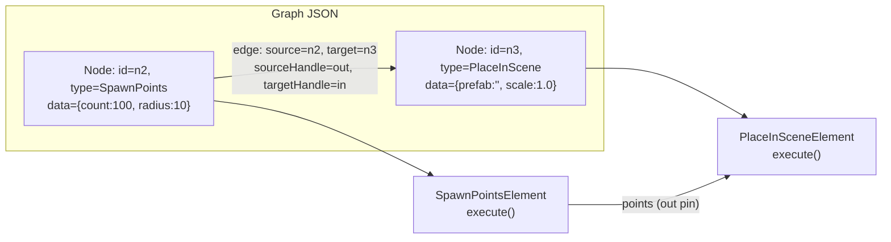

# Graph JSON 与 Schema：图数据契约

> [返回目录](index.md) | 前置：[项目总览](00-overview.md) | 基于 commit `f50d744`

## 学习目标
读完并完成实践后，你能够：
- 手写一个合法的最小 Graph JSON 并通过验证
- 解释 node-manifest.json 如何驱动 Web/Unity/C++ 三端的节点定义
- 从 Graph JSON 追踪到 C++ `Graph` 结构的解析路径

## 1. 从失败场景开始

假设你手写了一个 Graph JSON，但忘记了 `version` 字段：

```json
{
  "nodes": [
    { "id": "n1", "type": "SpawnPoints", "data": { "count": 10 } }
  ],
  "edges": []
}
```

调用 `pcg_validate_graph()` 会返回 `PCG_ERR_INVALID_JSON`，错误消息为 `"Missing or invalid version"`。

再假设你拼写错误，把 `SpawnPoints` 写成了 `SpawnPoint`：

```json
{
  "version": "1.0",
  "nodes": [
    { "id": "n1", "type": "SpawnPoint", "data": { "count": 10 } }
  ],
  "edges": []
}
```

这次 JSON 格式正确，但验证返回 `PCG_ERR_UNKNOWN_NODE`，错误消息为 `"Unknown node type: \"SpawnPoint\""`。

这两个场景说明 Graph JSON 有**两层验证**：结构格式验证和节点类型验证。证据：E-037。

## 2. 心智模型

Graph JSON 是一个 **有向无环图（DAG）** 的文本表示。它描述三件事：

1. **有哪些节点**（`nodes` 数组）——每个节点有 id、type、data
2. **节点之间如何连接**（`edges` 数组）——每条边有 source、target、handle
3. **图的版本**（`version` 字段）——当前仅支持 `"1.0"`



**Node Manifest** 是另一份 JSON 文件（`schema/node-manifest.json`），它定义**节点类型**的元数据：每种节点有哪些输入/输出 Pin、哪些参数、参数的类型和默认值。它是 **SSOT（Single Source of Truth）**，Web 编辑器和 Unity 编辑器都消费它来动态生成 UI。证据：E-036, D-009。

**区分**：Graph JSON 描述**图实例**（这张图里有哪些节点），Node Manifest 描述**节点类型**（SpawnPoints 这种节点长什么样）。

## 3. 原理与推导

### 3.1 Graph JSON 结构

```json
{
  "version": "1.0",          // 必填，当前仅支持 "1.0"
  "nodes": [                  // 必填，数组
    {
      "id": "n2",             // 必填，唯一标识
      "type": "SpawnPoints",  // 必填，必须在 Node Manifest 中注册
      "position": { "x": 0, "y": 0 },  // 可选，编辑器画布位置
      "data": {               // 必填，节点参数
        "count": 100,
        "radius": 10.0
      }
    }
  ],
  "edges": [                  // 必填，数组（可为空）
    {
      "id": "e1",             // 可选
      "source": "n2",         // 必填，源节点 id
      "target": "n3",         // 必填，目标节点 id
      "sourceHandle": "out",  // 可选，默认 "out"
      "targetHandle": "in"    // 可选，默认 "in"
    }
  ]
}
```

来源：`schema/example.pcg`，commit `f50d744`。证据：E-035。

### 3.2 Node Manifest 结构

以 `SpawnPoints` 为例（来源：`schema/node-manifest.json`）：

```json
{
  "type": "SpawnPoints",
  "displayName": "Spawn Points",
  "category": "Generation",
  "inputs": [],
  "outputs": [{ "id": "out", "label": "Points", "pinType": "SpatialPoint" }],
  "properties": {
    "count": { "type": "integer", "default": 100, "minimum": 0 },
    "radius": { "type": "number", "default": 10.0, "minimum": 0 }
  }
}
```

关键字段：
- `inputs`/`outputs`：定义 Pin 的 id、label、pinType（`SpatialPoint`/`SpatialMesh`/`SpatialSpline`/`Texture`/`Param`/`Any`）
- `properties`：定义参数的 JSON Schema 类型、默认值、约束
- `category`：用于编辑器分组（Generation/Spawner/Mesh/Spline/Geometry/Structural/Material/UV/Output）
- `outputGroups`：某些节点（如 `SweepAlongSpline`、`BooleanMesh`）声明输出几何体的命名组

### 3.3 为什么用两份文件而不是一份

| 方案 | 优点 | 缺点 |
|------|------|------|
| 合并（Graph JSON 内嵌节点定义） | 单文件自包含 | 每个图都重复定义节点类型，冗余 |
| 分离（当前方案） | 节点定义只维护一份，多端共用 | 编辑器需要同时加载两份文件 |

选择分离的理由：Web/Unity/C++ 三端共用同一份 Manifest，避免定义不一致。证据：D-009。

### 3.4 验证流程

`pcg_validate_graph()` 执行两层验证（证据：E-037）：

1. **JSON 解析**（`parse_graph()`）：检查 JSON 语法、必填字段、节点 id 唯一性
2. **结构验证**（`validate_graph_structure()`）：检查版本号、节点类型是否注册、边的 source/target 是否存在、自环检测、环检测（Kahn 算法）

## 4. 映射到当前源码

### 4.1 解析路径

| 顺序 | 符号 | 职责 | 输入 | 输出 | 证据 |
|------|------|------|------|------|------|
| 1 | `pcg_validate_graph()` | C API 入口，调用 parse + validate | JSON 字符串 | `PcgResultCode` | E-037 |
| 2 | `parse_graph()` | JSON → `Graph` 结构 | `const char* json` | `Graph& out_graph` | E-037 |
| 3 | `validate_graph_structure()` | 结构合法性检查 | `const Graph&` | `PcgResultCode` | E-037 |

### 4.2 关键片段

`parse_graph()` 的核心逻辑（来源：`pcg-core/src/graph_parser.cpp`，commit `f50d744`）：

```cpp
PcgResultCode parse_graph(const char* json, Graph& out_graph,
                          char* err_buf, int err_buf_size)
{
    // ... JSON 解析和字段检查 ...

    Graph graph;
    graph.version = doc["version"].get<std::string>();

    std::unordered_set<std::string> node_ids;
    for (const auto& node_json : doc["nodes"]) {
        GraphNode node;
        node.id = node_json["id"].get<std::string>();
        node.type = node_json["type"].get<std::string>();
        node.data = node_json["data"];

        if (!node_ids.insert(node.id).second)
            return fail(err_buf, err_buf_size, PCG_ERR_INVALID_JSON, "Duplicate node id");

        graph.nodes.push_back(std::move(node));
    }

    for (const auto& edge_json : doc["edges"]) {
        GraphEdge edge;
        edge.source = edge_json["source"].get<std::string>();
        edge.target = edge_json["target"].get<std::string>();
        edge.source_handle = edge_json.value("sourceHandle", "out");
        edge.target_handle = edge_json.value("targetHandle", "in");
        graph.edges.push_back(std::move(edge));
    }

    out_graph = std::move(graph);
    return PCG_OK;
}
```

注意 `data` 字段被原样存储为 `nlohmann::json`——解析器不验证参数内容，参数验证由各 Element 的 `execute()` 方法负责。

`validate_graph_structure()` 中的节点类型检查：

```cpp
if (!is_known_node_type(node.type)) {
    char msg[512];
    std::snprintf(msg, sizeof(msg), "Unknown node type: \"%s\"", node.type.c_str());
    return fail(err_buf, err_buf_size, PCG_ERR_UNKNOWN_NODE, msg);
}
```

`is_known_node_type()` 调用 `elements::is_known_element_type()`，后者通过 `find_element()` 在注册表中查找。这建立了 **Graph JSON → Element 注册表** 的联系。证据：E-024。

### 4.3 Node Manifest 的消费方

| 消费方 | 文件 | 用途 |
|--------|------|------|
| Web 编辑器 | `web/pcg-editor/src/nodeManifest.ts` | 动态生成节点面板和端口 |
| Unity 编辑器 | `Unity/.../Editor/Graph/node-manifest.json` | 动态生成 GraphView 节点和端口 |
| C++ 核心 | 不直接消费 Manifest | 通过 Element 注册表隐式定义可用节点类型 |

C++ 核心不读 Manifest 文件——节点类型可用性由 `element_registry.cpp` 中的 `register_builtin_elements()` 决定。Manifest 是编辑器侧的 UI 元数据。证据：E-024。

### 4.4 边的 Handle 语义

`sourceHandle` 和 `targetHandle` 默认为 `"out"` 和 `"in"`。对于多输入节点（如 `SweepAlongSpline` 有 `backbone` 和 `profile` 两个输入），handle 用于区分数据路由到哪个输入 pin：

```json
{
  "source": "spline_node",
  "target": "sweep_node",
  "sourceHandle": "out",
  "targetHandle": "backbone"
}
```

在执行引擎的 `gather_inputs()` 中，handle 成为 `PcgDataCollection` 中的查找 key。证据：E-010。

## 5. 边界、失败与恢复

| 场景 | 代码行为 | 可观察信号 | 根因 | 恢复/排查 | 证据 |
|------|----------|------------|------|-----------|------|
| 缺少 `version` 字段 | 返回 `PCG_ERR_INVALID_JSON` | err_buf: "Missing or invalid version" | JSON 不符合契约 | 添加 `"version": "1.0"` | E-037 |
| 未知节点类型 | 返回 `PCG_ERR_UNKNOWN_NODE` | err_buf: "Unknown node type: \"X\"" | Element 未注册 | 检查拼写或注册新 Element | E-037 |
| 重复节点 id | 返回 `PCG_ERR_INVALID_JSON` | err_buf: "Duplicate node id" | id 不唯一 | 修改 id | E-037 |
| 图中存在环 | 返回 `PCG_ERR_CYCLE_DETECTED` | err_buf: "Cycle detected in graph" | 边形成循环 | 检查边方向 | E-037, E-009 |
| 自环 | 返回 `PCG_ERR_CYCLE_DETECTED` | err_buf: "Self-loop detected" | source == target | 修正边 | E-037 |
| 边引用不存在的节点 | 返回 `PCG_ERR_INVALID_JSON` | err_buf: "Edge source/target not found" | 节点 id 拼写错误 | 修正 id | E-037 |

## 6. 动手实践

### 6.1 目标
手写一个三节点 Graph JSON，包含 SpawnPoints → PlaceInScene → Output，并通过验证。

### 6.2 前置条件
- 已构建 `pcg-core`（或能调用 `pcg_validate_graph`）
- 或者：有 Unity PcgPlugin 环境

### 6.3 步骤
1. 创建文件 `test-graph.pcg`：

```json
{
  "version": "1.0",
  "nodes": [
    { "id": "n1", "type": "SpawnPoints", "data": { "count": 50, "radius": 5.0 } },
    { "id": "n2", "type": "PlaceInScene", "data": { "prefab": "cube", "scale": 2.0 } },
    { "id": "n3", "type": "Output", "data": { "label": "MyOutput" } }
  ],
  "edges": [
    { "source": "n1", "target": "n2", "sourceHandle": "out", "targetHandle": "in" },
    { "source": "n2", "target": "n3", "sourceHandle": "out", "targetHandle": "in" }
  ]
}
```

2. 在 Unity 中通过 **PCG → Run Graph from File…** 加载此文件
3. 观察 Scene 视图中的青色球体 Gizmo

### 6.4 预期结果
- 50 个点在半径 5 的圆盘内生成
- Unity Console 无错误
- Scene 视图显示 PCG Preview 对象

### 6.5 失败时检查
- Console 报 `Unknown node type`：检查 `type` 拼写
- Console 报 `Cycle detected`：检查 edges 是否形成环
- 无预览：确认最后一个节点是 `Output` 类型或无出边节点

## 7. 自检

1. Graph JSON 中的 `data` 字段在解析阶段是否被验证？如果传入了 Element 不认识的参数会怎样？
2. `sourceHandle` 和 `targetHandle` 在执行引擎中如何被使用？
3. 为什么 C++ 核心不直接消费 `node-manifest.json`？
4. 如果图中同时有两个无出边节点（一个 `Output`，一个 `PlaceInScene`），Sink 会选哪个？

<details>
<summary>参考答案</summary>

1. `data` 字段在解析阶段不被验证——它被原样存储为 `nlohmann::json`。参数验证由各 Element 的 `execute()` 方法负责。不认识的参数会被忽略（`node->data.value("key", default)` 使用默认值）。证据：E-037, E-027。
2. 在 `gather_inputs()` 中，`target_handle` 成为 `PcgDataCollection` 中的查找 key。例如 `targetHandle: "backbone"` 意味着上游输出被放入 `ctx.inputs` 的 `"backbone"` 标签下。`source_handle` 用于从上游输出的 collection 中查找对应 pin。证据：E-010。
3. C++ 核心通过 `element_registry.cpp` 的 `register_builtin_elements()` 隐式定义可用节点类型。节点类型的可用性由代码注册决定，而非外部配置。Manifest 是编辑器侧的 UI 元数据（参数面板、端口显示），C++ 核心不需要这些信息来执行图。证据：E-024。
4. 优先选 `type == "Output"` 的节点。如果都没有 Output 类型，则选第一个无出边节点（`fallback_sink`）。证据：E-012。

</details>

## 8. 证据与延伸阅读
- E-035：`internal/graph_types.hpp` — Graph/GraphNode/GraphEdge 结构定义
- E-036：`schema/node-manifest.json` — 节点类型定义 SSOT
- E-037：`graph_parser.cpp` — 解析和验证逻辑
- E-010：`graph_executor.cpp:gather_inputs` — handle 的使用
- E-024：`element_registry.cpp:register_builtin_elements` — 节点注册

## 9. 下一步
- [02 C API 层](02-c-api-layer.md) — 理解从外部调用核心库的入口和 API 演进
