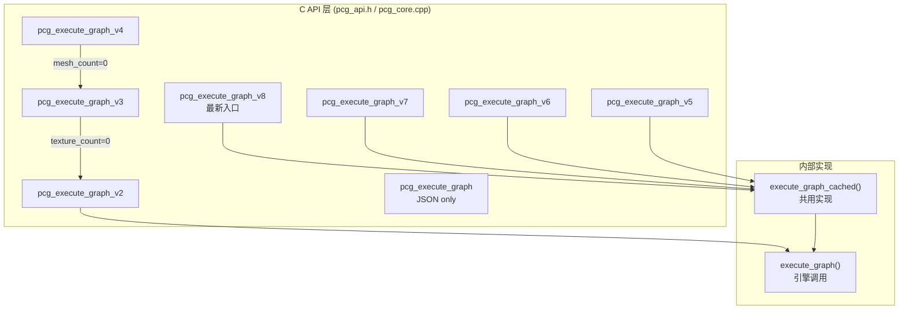

# C API 层：从外部调用核心库的入口

> [返回目录](index.md) | 前置：[Graph JSON 与 Schema](01-graph-json-and-schema.md) | 基于 commit `f50d744`

## 学习目标
读完并完成实践后，你能够：
- 解释 API v1→v8 的 additive 演进逻辑和向后兼容策略
- 从 `pcg_execute_graph_v8` 追踪到结果序列化的完整路径
- 说明 Job scope 和 cancellation 机制如何工作

## 1. 从失败场景开始

调用 `pcg_execute_graph()` 执行一个包含 mesh 输出的图，返回 `PCG_ERR_EXECUTION`。错误消息可能是 `"Mesh result requires out_mesh_buf"`。

根因：v1 API (`pcg_execute_graph`) 只支持 JSON 输出，不支持 mesh binary。对于 mesh sink 图，必须使用 v2 或更高版本 API。证据：E-002, E-005。

## 2. 心智模型

C API 是 pcg-core 对外的唯一接口。所有外部调用（Unity、Web、测试）都通过 `pcg_api.h` 中声明的 C 函数进入。



## 3. 原理与推导

### 3.1 API 版本演进

每个新版本 additive 增加功能，保持向后兼容（证据：E-002, D-001）：

| 版本 | 新增功能 | 引入 SHA | fallback |
|------|----------|----------|----------|
| v1 | JSON in/out | `523682e` | — |
| v2 | Mesh binary 输出 | `136d751` | — |
| v3 | PcgTextureSlot 运行时纹理上传 | `74d93d7` | texture_count=0 → v2 |
| v4 | PcgMeshSlot 运行时网格上传 | — | mesh_count=0 → v3 |
| v5 | PcgCookStats + per-node cook cache | `5a419e2` | — |
| v6 | Point binary + spawn mesh binary | — | — |
| v7 | PcgSplineSlot 运行时样条线上传 | — | spline_count=0 → v6 |
| v8 | Geometry binary 导出 | `f50d744` | — |

**设计模式**：v5-v8 共用 `execute_graph_cached()` 实现，区别仅在于传入的参数和输出 buffer。

### 3.2 结果序列化

`write_execution_result()` 根据 `GraphResultKind` 选择序列化方式（证据：E-005）：

| Kind | 条件 | 输出 |
|------|------|------|
| Mesh | sink 输出 Geometry 或 Mesh | out_mesh_buf + optional out_geometry_buf |
| Points | sink 输出 Points | out_points_buf + optional out_mesh_buf (spawn mesh) |
| JSON | sink 输出 JSON | out_json |

**Mesh binary** (v2 格式, 证据：E-019)：
```
Header (20 bytes): magic(4) | version(4) | vertex_count(4) | index_count(4) | flags(4)
Payload: positions(float32×3×N) | indices(uint32×M) | [normals] | [colors] | [uvs]
```

**Point binary** (v1 格式, 证据：E-020)：
```
Header (16 bytes): magic(4) | version(4) | point_count(4) | attr_flags(4)
Payload: positions(float32×3×N) | [normals] | [uv] | [triIndex] | [scale] | [rotation]
```

**Geometry binary** (v8 新增, 证据：E-021)：
- 序列化原始 n-gon PcgGeometry（pre-triangulation）
- best-effort：buffer 不足时跳过，mesh cook 仍返回 PCG_OK

### 3.3 Job Scope 与 Cancellation

每个 API 调用创建一个 `JobScope`（证据：E-006, E-007, D-011）：

```cpp
struct JobScope {
    explicit JobScope(uint64_t id) : job_id(id) {
        t_job_id = job_id;
        g_running_job.store(job_id, std::memory_order_relaxed);
    }
    ~JobScope() {
        t_job_id = 0;
        // 仅当当前 job 仍是自己时才清零
        if (g_running_job.load() == job_id)
            g_running_job.store(0, std::memory_order_relaxed);
    }
    uint64_t job_id;
};
```

**Cancel 机制**：
- `pcg_request_cancel()`：设置 `g_cancel_job` 为当前 `g_running_job`
- `is_cancel_requested_now()`：检查全局 cancel + per-job cancel
- 在图执行中每个节点前后检查 cancel

**为什么用 per-job ID**：防止旧 job 的 cancel 误触新 job。如果 job A 被取消但执行未立即停止，新 job B 开始后，A 的 cancel 不应影响 B。`g_cancel_job` 只匹配当前 running job ID。

### 3.4 执行流程

`execute_graph_cached()` 的完整流程（证据：E-004）：

```
1. g_cancel_requested = false
2. 创建 JobScope (job_id = g_job_counter++)
3. pcg_validate_graph(json)      → 结构验证
4. parse_graph(json, graph)     → JSON → Graph
5. build_texture_runtime()      → 纹理上传
6. build_mesh_runtime()          → 网格上传
7. build_spline_runtime()        → 样条线上传
8. execute_graph(graph, seed, result, ...)  → 图执行
9. write_execution_result(result, ...)      → 结果序列化
10. 填充 PcgCookStats 和 perf_json
```

## 4. 映射到当前源码

### 4.1 调用路径

| 顺序 | 符号 | 职责 | 输入 | 输出 | 证据 |
|------|------|------|------|------|------|
| 1 | `pcg_execute_graph_v8()` | C API 入口 | JSON + slots + buffers | PcgResultCode + outputs | E-003 |
| 2 | `execute_graph_cached()` | 共用实现 | 同上 | 同上 | E-004 |
| 3 | `pcg_validate_graph()` | 结构验证 | JSON string | PcgResultCode | E-037 |
| 4 | `parse_graph()` | JSON 解析 | JSON string | Graph 结构 | E-037 |
| 5 | `build_texture/mesh/spline_runtime()` | 运行时上下文构建 | Slot arrays | Runtime objects | E-004 |
| 6 | `execute_graph()` | 图执行引擎 | Graph + seed + runtimes | GraphExecutionResult | E-008 |
| 7 | `write_execution_result()` | 结果序列化 | GraphExecutionResult | Binary/JSON buffers | E-005 |

### 4.2 关键片段

API 宏定义和版本（来源：`pcg_api.h`，commit `f50d744`）：

```cpp
#if defined(_WIN32) && !defined(PCG_STATIC)
  #ifdef PCG_EXPORTS
    #define PCG_API __declspec(dllexport)
  #else
    #define PCG_API __declspec(dllimport)
  #endif
#elif defined(__APPLE__) && !defined(PCG_STATIC)
  #ifdef PCG_EXPORTS
    #define PCG_API __attribute__((visibility("default")))
  #else
    #define PCG_API
  #endif
#else
    #define PCG_API
#endif
```

三种模式：Windows DLL (dllexport/dllimport)、macOS dylib (visibility)、静态构建 (无装饰)。证据：E-001。

版本信息（来源：`pcg_core.cpp`，commit `f50d744`）：

```cpp
const char* pcg_get_version(void)
{
    static char buf[64];
    std::snprintf(buf, sizeof(buf),
                  "pcg-core %d.%d.%d (bmesh-tier1)",
                  PCG_API_VERSION_MAJOR,
                  PCG_API_VERSION_MINOR,
                  PCG_API_VERSION_PATCH);
    return buf;
}
```

输出：`pcg-core 0.1.2 (bmesh-tier1)`。

### 4.3 v8 的 fallback 链

v5-v8 都调用 `execute_graph_cached()`（来源：`pcg_core.cpp`，commit `f50d744`）：

```cpp
PcgResultCode pcg_execute_graph_v8(const char* json, int seed, ...)
{
    return execute_graph_cached(json, seed, textures, texture_count,
                                meshes, mesh_count, splines, spline_count,
                                out_kind, out_json, out_json_size,
                                out_mesh_buf, out_mesh_buf_size,
                                out_points_buf, out_points_buf_size,
                                out_point_count, out_point_attr_flags,
                                out_vertex_count, out_index_count,
                                out_stats, out_perf_json, out_perf_json_size,
                                out_geometry_buf, out_geometry_buf_size,
                                out_geometry_bytes_written,
                                err_buf, err_buf_size, &g_cook_cache);
}
```

v4 的 fallback 到 v3（来源：`pcg_core.cpp`，commit `f50d744`）：

```cpp
PcgResultCode pcg_execute_graph_v4(...)
{
    if (!meshes || mesh_count <= 0)
        return pcg_execute_graph_v3(json, seed, textures, texture_count, ...);
    // ...
}
```

### 4.4 Mesh Binary Header

二进制格式常量（来源：`pcg_api.h`，commit `f50d744`）：

```cpp
#define PCG_MESH_BINARY_MAGIC 0x4D474350u   /* 'PCGM' little-endian */
#define PCG_MESH_BINARY_VERSION 2u
#define PCG_MESH_BINARY_HEADER_SIZE 20

#define PCG_POINT_BINARY_MAGIC 0x50544750u   /* 'PGTP' little-endian */
#define PCG_POINT_BINARY_VERSION 2u
#define PCG_POINT_BINARY_HEADER_SIZE 16
```

## 5. 边界、失败与恢复

| 场景 | 代码行为 | 可观察信号 | 根因 | 恢复/排查 | 证据 |
|------|----------|------------|------|-----------|------|
| v1 用于 mesh sink | 返回 `PCG_ERR_EXECUTION` | "Mesh result requires out_mesh_buf" | v1 不支持 mesh | 使用 v2+ | E-002 |
| Buffer 太小 | 返回 `PCG_ERR_EXECUTION` | "buffer too small (need N bytes)" | 输出超出预期 | 增大 buffer | E-005 |
| JSON 格式错误 | 返回 `PCG_ERR_INVALID_JSON` | err_buf 含解析错误 | JSON 语法问题 | 修正 JSON | E-037 |
| 未知节点 | 返回 `PCG_ERR_UNKNOWN_NODE` | err_buf: "Unknown node type" | Element 未注册 | 注册或修正 type | E-037 |
| 图中有环 | 返回 `PCG_ERR_CYCLE_DETECTED` | err_buf: "Cycle detected" | 边形成循环 | 移除环边 | E-009 |
| Cancel 后继续 | 返回 `PCG_ERR_EXECUTION` | "Execution cancelled" | pcg_request_cancel 被调用 | 正常行为 | E-007 |
| Geometry buffer 不足 | out_geometry_bytes_written=0 | mesh cook 仍返回 PCG_OK | buffer 太小 | 增大 geometry buffer | E-021 |

## 6. 动手实践

### 6.1 目标
验证 `pcg_validate_graph()` 对合法和非法 JSON 的行为。

### 6.2 前置条件
- 已构建 pcg-core

### 6.3 步骤
1. 构建：`.\scripts\build-pcg-core.ps1`
2. 运行测试：`ctest --test-dir pcg-core\build -C Release -R test_executor`
3. 在测试中验证合法图返回 `PCG_OK`，缺少 version 返回 `PCG_ERR_INVALID_JSON`

### 6.4 预期结果
- `test_executor` 通过
- 合法图验证返回 `PCG_OK`
- 非法图验证返回对应错误码

### 6.5 失败时检查
- 编译失败：检查 CMake 和 VS 2022 配置
- 测试未找到：检查 ctest 注册

## 7. 自检

1. v4 在 `mesh_count=0` 时的行为是什么？为什么这样设计？
2. `JobScope` 的析构函数为什么要检查 `g_running_job == job_id` 才清零？
3. `write_execution_result()` 对 Points 结果，什么情况下会同时写入 mesh binary？
4. Geometry binary 导出是 best-effort 的，这意味着什么？

<details>
<summary>参考答案</summary>

1. v4 在 `mesh_count=0` 时 fallback 调用 v3。v3 在 `texture_count=0` 时 fallback 调用 v2。这样设计是为了向后兼容——调用者不需要关心新功能是否被使用，API 自动降级到能处理的最小版本。证据：E-002, D-001。
2. 防止旧 job 的析构清零新 job 的 running 状态。如果 job A 被取消后仍在执行，新 job B 开始后 g_running_job=B，A 析构时不应把 g_running_job 设为 0。只有当前 job 仍是自己时才清零。证据：E-006, D-011。
3. 当 Points 结果中包含 `spawnMesh`（如 `StaticMeshSpawner` 节点输出的实例化网格）时，`write_execution_result()` 会同时将 spawn mesh 写入 `out_mesh_buf`，并设置 `out_vertex_count` 和 `out_index_count`。此时 `out_kind` 仍为 `PCG_RESULT_KIND_POINTS`。证据：E-005。
4. Geometry binary 导出是可选的——如果 `out_geometry_buf` 为 null、buffer 不足或 sink 无 Geometry，则 `out_geometry_bytes_written` 保持 0，但 mesh cook 仍返回 `PCG_OK`。调用者应检查 bytes_written 是否 >0 来判断是否有 geometry binary 数据。证据：E-021。

</details>

## 8. 证据与延伸阅读
- E-001：`pcg_api.h:1-20` — PCG_API 宏和导出模式
- E-002：`pcg_api.h` v1-v8 — API 版本演进
- E-003：`pcg_api.h:pcg_execute_graph_v8` — 当前最完整入口
- E-004：`pcg_core.cpp:execute_graph_cached` — 执行流程
- E-005：`pcg_api.h:PcgResultKind`, `pcg_core.cpp:write_execution_result` — 结果序列化
- E-006：`pcg_core.cpp:JobScope` — Job scope 机制
- E-007：`pcg_core.cpp:pcg_request_cancel, is_cancel_requested_now` — Cancel 机制

## 9. 下一步
- [03 图执行引擎](03-graph-executor.md) — 理解 `execute_graph()` 内部的拓扑排序和逐节点执行
