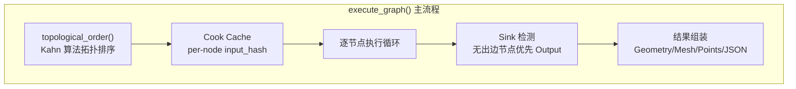

# 图执行引擎：拓扑排序、逐节点执行与 Cook Cache

> [返回目录](index.md) | 前置：[C API 层](02-c-api-layer.md) | 基于 commit `f50d744`

## 学习目标
读完并完成实践后，你能够：
- 解释 Kahn 拓扑排序算法在图执行中的应用
- 理解 Cook Cache 的 per-node input_hash 命中机制
- 追踪从 Sink 检测到结果组装的完整路径

## 1. 从失败场景开始

构建一个包含环的图：`A → B → C → A`。执行时返回 `PCG_ERR_CYCLE_DETECTED`，错误消息 `"Cycle detected during execution"`。

这是拓扑排序的环检测——`topological_order()` 产出的 order 数组长度不等于节点数，说明有节点无法被排序（在环中）。证据：E-009。

## 2. 心智模型

图执行引擎是 pcg-core 的核心，位于 C API 层和 Element 系统之间。



## 3. 原理与推导

### 3.1 拓扑排序 (Kahn 算法)

`topological_order()` 使用 Kahn 算法（证据：E-008）：

1. 计算每个节点的入度（indegree）
2. 入度为 0 的节点入队
3. 出队一个节点，减少其后继的入度
4. 后继入度变为 0 时入队
5. 重复直到队列为空
6. 如果 order.size() != nodes.size()，说明有环

```cpp
std::queue<std::string> ready;
for (const auto& [node_id, degree] : indegree) {
    if (degree == 0)
        ready.push(node_id);
}

std::vector<std::string> order;
while (!ready.empty()) {
    const std::string current = ready.front();
    ready.pop();
    order.push_back(current);
    for (const auto& next : adjacency[current]) {
        if (--indegree[next] == 0)
            ready.push(next);
    }
}

if (order.size() != graph.nodes.size()) {
    code = fail(err_buf, err_buf_size, PCG_ERR_CYCLE_DETECTED, "Cycle detected during execution");
    return {};
}
```

来源：`graph_executor.cpp`，commit `f50d744`。证据：E-008, E-009。

### 3.2 输入收集 (gather_inputs)

`gather_inputs()` 按边收集上游输出到 `ctx.inputs`（证据：E-010）：

数据类型优先级：
```
Points > Geometry > Mesh > JSON
```

**为什么 Geometry 优先于 Mesh**：mesh-first 会错误丢弃 n-gon。中间节点（如 SubdivideMesh）不应隐藏上游的 Geometry。延迟三角化要求 Geometry 尽可能传递到 Sink。证据：D-004, E-010。

**spawnMesh 特殊处理**：如果上游有 `spawnMesh`，额外传递到 `ctx.inputs`。

### 3.3 Cook Cache

Cook Cache 使用 per-node input_hash 实现增量执行（证据：E-011, D-005）：

**结构哈希**（`compute_graph_structure_hash`）：基于节点数、边数、节点类型、边结构。结构变化时整个缓存 clear。

**节点输入哈希**（`compute_node_input_hash`）：基于节点参数 + seed + 上游输出哈希 + 纹理/网格/样条线 slot。如果与缓存中的一致，跳过执行。

**输出哈希**（`compute_output_hash`）：基于输出数据内容。写入缓存时一同存储。

```
执行每个节点时：
1. 计算上游 upstream_hashes
2. 计算 input_hash = compute_node_input_hash(node, seed, upstream_hashes, ...)
3. cache.try_get(node_id, input_hash, cached_outputs, cached_output_hash)
4. 如果命中 → 使用缓存输出，跳过 execute()
5. 如果未命中 → gather_inputs → element->execute() → cache.put()
```

### 3.4 Sink 检测

Sink 是图中无出边的节点（证据：E-012）：

```cpp
for (const auto& node : graph.nodes) {
    bool has_outgoing = false;
    for (const auto& edge : graph.edges) {
        if (edge.source == node.id) {
            has_outgoing = true;
            break;
        }
    }
    if (!has_outgoing) {
        if (node.type == "Output" && !sink)
            sink = &node;
        if (!fallback_sink)
            fallback_sink = &node;
    }
}
if (!sink)
    sink = fallback_sink;
```

优先选 `type == "Output"` 的无出边节点。如果没有 Output 类型，选第一个无出边节点。证据：E-012。

### 3.5 Sink 输出优先级

Sink 输出按以下优先级组装结果（证据：E-013）：

| 优先级 | 条件 | 结果类型 | 处理 |
|--------|------|----------|------|
| 1 | find("out") 有 points ptr | Points | 直接输出 |
| 2 | primary JSON 含 "points" 数组 | JSON | 直接输出 |
| 3 | find("out") 有 Geometry | Mesh | compute_split_normals 三角化 |
| 4 | primary 有 Geometry | Mesh | compute_split_normals 三角化 |
| 5 | find("out") 有 Mesh | Mesh | 直接输出 + try_salvage_upstream_geometry |
| 6 | primary 有 Mesh | Mesh | 直接输出 + try_salvage_upstream_geometry |
| 7 | fallback | JSON | 直接输出 |

### 3.6 try_salvage_upstream_geometry

当 Sink 只有 Mesh 但没有 Geometry 时（例如旧版节点输出 Mesh 而非 Geometry），BFS 沿反向边搜索最近的 Geometry，用于 Scene wire preview（证据：E-014）。

### 3.7 Node Stats 与 Group Stats

`build_node_stats()` 为每个节点生成 Houdini 风格的几何统计（证据：E-015）：
- point_count、face_count、triangle_count

`build_per_node_groups()` 将每个节点的 group 信息展平为数组，供 Unity `JsonUtility` 反序列化。

face group members 被展开为 mesh triangle indices（fan-triangulation：N-gon face 产生 N-2 个三角形）。

## 4. 映射到当前源码

### 4.1 执行路径

| 顺序 | 符号 | 职责 | 证据 |
|------|------|------|------|
| 1 | `register_builtin_elements()` | 注册所有节点 Element | E-024 |
| 2 | `topological_order()` | Kahn 拓扑排序 | E-008 |
| 3 | `compute_graph_structure_hash()` | 结构哈希 | E-011 |
| 4 | `compute_node_input_hash()` | 节点输入哈希 | E-011 |
| 5 | `cache.try_get()` / `cache.put()` | 缓存命中/写入 | E-011 |
| 6 | `gather_inputs()` | 收集上游输出 | E-010 |
| 7 | `element->execute()` | 执行节点逻辑 | E-023 |
| 8 | `build_node_stats()` | 几何统计 | E-015 |
| 9 | Sink 检测 | 确定输出来源 | E-012 |
| 10 | 结果组装 | 序列化输出 | E-013 |

### 4.2 关键片段

Cook Cache 主循环（来源：`graph_executor.cpp`，commit `f50d744`）：

```cpp
for (const auto& node_id : order) {
    if (is_cancel_requested && is_cancel_requested())
        return fail(err_buf, err_buf_size, PCG_ERR_EXECUTION, "Execution cancelled");

    const GraphNode* node = node_by_id[node_id];

    uint64_t input_hash = 0;
    if (cache)
        input_hash = compute_node_input_hash(*node, seed, upstream_hashes, textures, meshes, splines);

    if (cache) {
        data::PcgDataCollection cached_outputs;
        uint64_t cached_output_hash = 0;
        if (cache->try_get(node_id, input_hash, cached_outputs, cached_output_hash)) {
            outputs[node_id] = std::move(cached_outputs);
            output_hashes[node_id] = cached_output_hash;
            if (perf) perf->add(node_id, node->type, 0.0, true);
            continue;
        }
    }

    // ... gather_inputs + element->execute() ...

    if (cache)
        cache->put(node_id, input_hash, out_hash, outputs[node_id]);
}
```

### 4.3 GraphExecutionResult

结果结构（来源：`graph_execution_result.hpp`，commit `f50d744`）：

```cpp
struct GraphExecutionResult {
    GraphResultKind kind = GraphResultKind::Json;
    nlohmann::json json;
    data::PcgMeshData mesh;
    std::shared_ptr<const data::PcgPointData> points;
    nlohmann::json point_sidecar;
    data::PcgMeshData spawn_mesh;
    std::shared_ptr<const data::PcgGeometry> source_geometry; // v8 新增
};
```

`source_geometry` 是 pre-triangulation 的 Sink geometry，用于 v8 geometry binary 导出。证据：E-013, E-021。

## 5. 边界、失败与恢复

| 场景 | 代码行为 | 可观察信号 | 根因 | 恢复/排查 | 证据 |
|------|----------|------------|------|-----------|------|
| 图中有环 | 返回 `PCG_ERR_CYCLE_DETECTED` | "Cycle detected during execution" | 边形成循环 | 移除环边 | E-009 |
| 未知节点类型 | 返回 `PCG_ERR_UNKNOWN_NODE` | "Unknown node type" | Element 未注册 | 注册或修正 type | E-024 |
| 上游输出缺失 | 返回 `PCG_ERR_EXECUTION` | "Missing upstream output" | 边引用了未执行的节点 | 检查图连通性 | E-010 |
| Cancel 请求 | 返回 `PCG_ERR_EXECUTION` | "Execution cancelled" | pcg_request_cancel() 被调用 | 正常行为 | E-007 |
| 结构变化 | cache.clear() | 全部节点重新执行 | 节点/边增删改 | 正常行为 | E-011 |
| 无 Sink 节点 | 返回 `PCG_ERR_EXECUTION` | "Graph has no sink node" | 所有节点都有出边 | 添加 Output 节点 | E-012 |
| Sink 无输出 | 返回 `PCG_ERR_EXECUTION` | "Sink node produced no output" | Sink 的 execute() 未产生输出 | 检查 Sink 上游 | E-013 |

## 6. 动手实践

### 6.1 目标
运行 executor 和 cook cache 测试，验证核心执行逻辑。

### 6.2 前置条件
- 已构建 pcg-core

### 6.3 步骤
```powershell
cd /path/to/PCG-AI
.\scripts\build-pcg-core.ps1 -RunTests
# 关注：
# test_executor — 验证基本执行、环检测、Sink 检测
# test_cook_cache — 验证缓存命中和失效
```

### 6.4 预期结果
- 所有测试通过
- test_executor 验证合法图执行成功，有环图返回错误
- test_cook_cache 验证相同输入命中缓存，参数变化时缓存失效

### 6.5 失败时检查
- 编译失败：检查 nlohmann/json 头文件路径
- 测试断言失败：检查 Graph 结构是否与预期一致

## 7. 自检

1. Kahn 算法如何检测图中的环？时间复杂度是多少？
2. `gather_inputs()` 为什么 Geometry 优先于 Mesh？
3. Cook Cache 的结构哈希不匹配时会发生什么？
4. `try_salvage_upstream_geometry` 的目的是什么？在什么场景下被触发？

<details>
<summary>参考答案</summary>

1. Kahn 算法处理后，如果排序结果 `order.size() != graph.nodes.size()`，说明有节点未被处理（入度始终不为 0），这些节点在环中。时间复杂度 O(V+E)。证据：E-008, E-009。
2. 因为 mesh-first 会错误丢弃 n-gon 拓扑。中间节点（如 SubdivideMesh）如果先找到 Mesh 就跳过 Geometry，会导致上游的 n-gon 面信息丢失。延迟三角化要求 Geometry 尽可能传递到 Sink。证据：D-004, E-010。
3. 结构哈希不匹配时，整个缓存被 `cache.clear()` 清空，所有节点在本次执行中重新计算。这发生在节点/边增删改时。证据：E-011。
4. 当 Sink 只有 Mesh 但没有 Geometry 时（例如旧版节点输出 Mesh 而非 Geometry），BFS 沿反向边搜索最近的 Geometry，用于 Scene wire preview。这样即使 Sink 输出的是已三角化的 Mesh，Scene 视图仍能显示原始 n-gon wireframe。证据：E-014。

</details>

## 8. 证据与延伸阅读
- E-008：`graph_executor.cpp:topological_order` — Kahn 拓扑排序
- E-009：`graph_executor.cpp:topological_order` — 环检测
- E-010：`graph_executor.cpp:gather_inputs` — 输入收集优先级
- E-011：`graph_executor.cpp` — Cook Cache
- E-012：`graph_executor.cpp` — Sink 检测
- E-013：`graph_executor.cpp` — Sink 输出优先级
- E-014：`graph_executor.cpp:try_salvage_upstream_geometry` — Geometry 补救
- E-015：`graph_executor.cpp:build_node_stats` — 节点统计

## 9. 下一步
- [04 数据模型](04-data-model.md) — 理解 PcgDataCollection 和二进制协议
