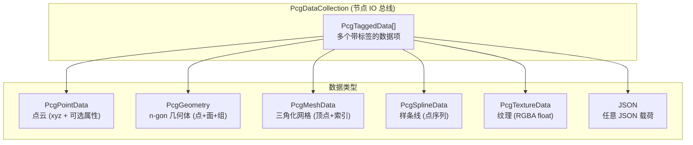

# 数据模型与二进制协议：PcgDataCollection、Geometry 与序列化

> [返回目录](index.md) | 前置：[图执行引擎](03-graph-executor.md) | 基于 commit `f50d744`

## 学习目标
读完并完成实践后，你能够：
- 解释 PcgDataCollection 多类型容器的结构和查找逻辑
- 理解 PcgGeometry 延迟三角化的设计理由
- 描述 Mesh/Point/Geometry 三种二进制格式的 header 布局

## 1. 从失败场景开始

一个中间节点（如 BevelMesh）执行后，下游 SubdivideMesh 收到的输入丢失了原始面的 n-gon 信息——所有面变成了三角形。这导致 Loop 细分在三角形边界上产生不正确的结果。

根因：如果 `gather_inputs()` 优先查找 Mesh 而非 Geometry，中间节点的三角化输出会覆盖上游的 n-gon Geometry。这就是为什么延迟三角化设计要求节点尽可能输出 PcgGeometry 而非 PcgMeshData。证据：D-004, E-010, E-017。

## 2. 心智模型

数据模型是节点之间传递数据的"总线"。一个 `PcgDataCollection` 可以同时持有多种类型的数据，通过 pin name 索引。



## 3. 原理与推导

### 3.1 PcgDataCollection

`PcgDataCollection` 是节点的输入/输出总线，对齐 UE PCGDataCollection 语义（证据：E-016, E-022）。

每个 `PcgTaggedData` 可以包含多种数据指针：

```cpp
struct PcgTaggedData {
    std::string tag;                                    // pin name
    PcgDataType type = PcgDataType::Unknown;
    nlohmann::json payload;                             // JSON 载荷
    std::shared_ptr<const PcgMeshData> mesh;
    std::shared_ptr<const PcgGeometry> geometry;
    std::shared_ptr<const PcgPointData> points;
    std::optional<PcgSplineData> splines;
};
```

来源：`data/pcg_data_collection.hpp`，commit `f50d744`。

查找方法通过 pin name（tag）定位：
- `find(tag)` → 返回 `PcgTaggedData*`
- `find_points_shared(tag)` → 返回 `shared_ptr<PcgPointData>`
- `find_geometry_shared(tag)` → 返回 `shared_ptr<PcgGeometry>`
- `find_mesh_shared(tag)` → 返回 `shared_ptr<PcgMeshData>`
- `find_splines(tag)` → 返回 `PcgSplineData*`
- `find_json(tag)` → 返回 `json*`

`primary_*` 方法返回第一个非空数据项。

### 3.2 PcgGeometry (延迟三角化)

`PcgGeometry` 存储 n-gon 几何体，三角化延迟到 Sink（证据：E-017, D-004）：

```cpp
class PcgGeometry {
    std::vector<PcgVec3> points_;                    // 顶点 (double 精度)
    std::vector<std::vector<int>> faces_;             // n-gon 面 (每个面是顶点索引数组)
    geometry::GroupTable groups_;                     // 命名组
    GeometryDetailMeta detail_;                      // 着色细节
};
```

来源：`data/pcg_geometry.hpp`，commit `f50d744`。

**为什么用 n-gon**：三角形 soup 丢失面的原始拓扑（哪些三角形属于同一个面），导致 bevel/boolean 无法正确识别面的边界。n-gon 保留了原始面信息。

**三角化时机**：Sink 处调用 `compute_split_normals(geometry, options)` 将 n-gon 三角化并计算法线。中间节点传递 raw geometry。

**ShadeMode**（证据：E-017）：
- `Auto`：按 group boundary + angle 分割法线
- `Smooth`：所有法线平滑
- `Flat`：每个面独立法线

### 3.3 PcgMeshData

`PcgMeshData` 是已三角化的网格（证据：E-016）：

```cpp
struct PcgVertex { float x, y, z; };

class PcgMeshData {
    std::vector<PcgVertex> vertices_;
    std::vector<int> triangles_;    // 每 3 个索引为一个三角形
    PcgMetadata metadata_;
};
```

### 3.4 PcgPointData

`PcgPointData` 是点云数据（证据：E-020）：

```cpp
struct PcgPoint { float x, y, z; };
// 可选属性：normal (nx,ny,nz), uv (u,v), triIndex, scale, rotation (xyzw)
```

`to_json()` 将点云序列化为 JSON，`write_point_binary()` 序列化为二进制。

### 3.5 二进制协议

#### Mesh Binary v2 (证据：E-019)

```
偏移  大小    字段
0     4       magic = 0x4D474350 ('PCGM')
4     4       version = 2
8     4       vertex_count
12    4       index_count
16    4       flags (bit 0: normals, bit 1: colors, bit 2: uvs)
--- Header 结束 (20 bytes) ---
20    12×N    positions (float32 xyz × vertex_count)
20+12N 4×M   indices (uint32 × index_count)
...    ...    optional normals (float32 xyz × N, if flags & 0x1)
...    ...    optional colors (float32 rgba × N, if flags & 0x2)
...    ...    optional uvs (float32 uv × N, if flags & 0x4)
```

v1 header: 16 bytes (无 flags 字段)，仅向后兼容读取。

#### Point Binary v1 (证据：E-020)

```
偏移  大小    字段
0     4       magic = 0x50544750 ('PGTP')
4     4       version = 1
8     4       point_count
12    4       attr_flags (PcgPointAttrFlags)
--- Header 结束 (16 bytes) ---
16    12×N    positions (float32 xyz × point_count)
...    ...    optional normals (float32 xyz × N, if attr_flags & 0x1)
...    ...    optional uv (float32 uv × N, if attr_flags & 0x2)
...    ...    optional triIndex (uint32 × N, if attr_flags & 0x4)
...    ...    optional scale (float32 × N, if attr_flags & 0x8)
...    ...    optional rotation (float32 xyzw × N, if attr_flags & 0x10)
```

`PcgPointAttrFlags`:
```cpp
PCG_POINT_ATTR_NORMAL    = 1 << 0
PCG_POINT_ATTR_UV        = 1 << 1
PCG_POINT_ATTR_TRI_INDEX = 1 << 2
PCG_POINT_ATTR_SCALE      = 1 << 3
PCG_POINT_ATTR_ROTATION   = 1 << 4
```

#### Geometry Binary (证据：E-021)

由 `write_geometry_binary(geometry, buf, buf_size)` 序列化。在 v8 API 中通过 `out_geometry_buf` 导出。best-effort：buffer 不足时跳过。

### 3.6 PcgContext

`PcgContext` 携带节点执行所需的全部上下文（证据：E-022）：

```cpp
struct PcgContext {
    int graph_seed;
    const Graph* graph;
    const GraphNode* node;
    const TextureRuntime* textures;
    const MeshRuntime* meshes;
    const SplineRuntime* splines;
    PcgDataCollection inputs;
    PcgDataCollection outputs;
    char* err_buf;
    int err_buf_size;
    bool (*is_cancel_requested)();
};
```

对齐 UE PCG 的 Context 语义——每个节点执行时获得完整的上下文。

## 4. 映射到当前源码

### 4.1 数据类型层次

| 类型 | 职责 | 存储内容 | 三角化 | 证据 |
|------|------|----------|--------|------|
| PcgPointData | 点云 | xyz + 可选属性 | N/A | E-020 |
| PcgGeometry | n-gon 几何体 | points + faces + groups + detail | 延迟 | E-017 |
| PcgMeshData | 三角化网格 | vertices + triangles + metadata | 已完成 | E-016 |
| PcgSplineData | 样条线 | 点序列 + closed 标记 | N/A | E-016 |
| PcgTextureData | 纹理 | width/height + RGBA float | N/A | E-016 |

### 4.2 关键片段

PcgGeometry 声明（来源：`data/pcg_geometry.hpp`，commit `f50d744`）：

```cpp
class PcgGeometry {
public:
    std::vector<PcgVec3>& points_mut() { return points_; }
    const std::vector<PcgVec3>& points() const { return points_; }
    std::vector<std::vector<int>>& faces_mut() { return faces_; }
    const std::vector<std::vector<int>>& faces() const { return faces_; }
    geometry::GroupTable& groups() { return groups_; }
    const geometry::GroupTable& groups() const { return groups_; }
    GeometryDetailMeta& detail() { return detail_; }
    const GeometryDetailMeta& detail() const { return detail_; }
};
```

注意 `faces_` 的类型是 `vector<vector<int>>`——每个面是一个顶点索引数组，可以是三角形（3 个索引）或 n-gon（>3 个索引）。

### 4.3 三角化函数

来源：`data/pcg_geometry.hpp`，commit `f50d744`：

```cpp
/// Fan-triangulate n-gon faces for display / legacy mesh nodes.
PcgMeshData triangulate_geometry(const PcgGeometry& geometry);

/// Triangulate with vertex split and per-vertex normals based on shade policy.
PcgMeshData compute_split_normals(const PcgGeometry& geometry, const NormalComputeOptions& options);

/// Rebuild polygon topology from triangle soup (weld + coplanar merge via BMesh).
PcgGeometry geometry_from_mesh(const PcgMeshData& mesh);
```

`triangulate_geometry()` 使用 fan 三角化（n-gon → n-2 个三角形）。
`compute_split_normals()` 在三角化的同时根据 ShadeMode 分割顶点并计算法线。
`geometry_from_mesh()` 是反向操作——从三角形 soup 重建 n-gon 拓扑。

## 5. 边界、失败与恢复

| 场景 | 代码行为 | 可观察信号 | 根因 | 恢复/排查 | 证据 |
|------|----------|------------|------|-----------|------|
| n-gon 面丢失 | 面变为三角形 | 下游操作结果不正确 | 中间节点三角化后丢失 Geometry | 确保节点输出 Geometry | E-017 |
| Buffer 太小 | `PCG_ERR_EXECUTION` | "buffer too small" | 输出数据超出 buffer | 增大 buffer | E-019 |
| Magic 不匹配 | 解析失败 | 预览为空 | C#/C++ 版本不同步 | 检查常量对齐 | E-019 |
| 空 Geometry | 0 点 0 面 | Scene 无预览 | 节点未生成数据 | 检查节点参数和上游输入 | E-017 |
| shared_ptr 循环引用 | 内存泄漏 | 内存持续增长 | 数据所有权设计问题 | 使用 const shared_ptr | E-016 |

## 6. 动手实践

### 6.1 目标
解析一个 Mesh Binary header 并验证 magic number。

### 6.2 前置条件
- 已构建 pcg-core

### 6.3 步骤
1. 运行 `test_geometry_export` 测试
2. 在测试中验证 Mesh Binary header 的 magic/version/vertex_count/index_count

### 6.4 预期结果
- `test_geometry_export` 通过
- Mesh Binary header 的 magic = 0x4D474350, version = 2
- Point Binary header 的 magic = 0x50544750, version = 1

### 6.5 失败时检查
- 测试失败：检查二进制写入和读取是否对称
- Magic 不匹配：检查端序（little-endian）

## 7. 自检

1. `PcgGeometry` 的 `faces_` 为什么是 `vector<vector<int>>` 而不是 `vector<Triangle>`？
2. `compute_split_normals()` 和 `triangulate_geometry()` 的区别是什么？
3. Mesh Binary v2 的 flags 字段中 bit 0/1/2 分别表示什么？
4. `PcgContext` 中的 `inputs` 和 `outputs` 分别由谁填充？

<details>
<summary>参考答案</summary>

1. 因为 `faces_` 存储的是 n-gon 面——每个面可以有任意数量的顶点（三角形=3，四边形=4，n-gon>4）。如果用 `vector<Triangle>` 就丢失了面的原始拓扑信息，无法区分哪些三角形属于同一个面。证据：E-017。
2. `triangulate_geometry()` 只做 fan 三角化，顶点共享（不分割）。`compute_split_normals()` 在三角化的同时根据 ShadeMode（Auto/Smooth/Flat）分割顶点并计算法线——例如 Flat 模式下每个面的顶点独立，Smooth 模式下共享顶点。证据：E-017。
3. bit 0 (0x1) = has normals, bit 1 (0x2) = has colors, bit 2 (0x4) = has uvs。每个 optional block 独立存在，任意组合。证据：E-019。
4. `inputs` 由 `gather_inputs()` 从上游节点的 outputs 中收集填充。`outputs` 由 Element 的 `execute()` 方法填充——执行完成后 `ctx.outputs` 被移动到 `outputs[node_id]` 中。证据：E-022, E-010。

</details>

## 8. 证据与延伸阅读
- E-016：`data/pcg_data_collection.hpp` — 多类型容器
- E-017：`data/pcg_geometry.hpp` — n-gon 几何体
- E-018：`geometry/group_table.hpp` — GroupTable
- E-019：`pcg_api.h:PCG_MESH_BINARY_*` — Mesh Binary 格式
- E-020：`pcg_api.h:PCG_POINT_BINARY_*` — Point Binary 格式
- E-021：`data/pcg_geometry_binary.hpp` — Geometry Binary
- E-022：`data/pcg_context.hpp` — PcgContext

## 9. 下一步
- [05 节点系统](05-element-system.md) — 理解 IPcgElement 接口和注册机制
