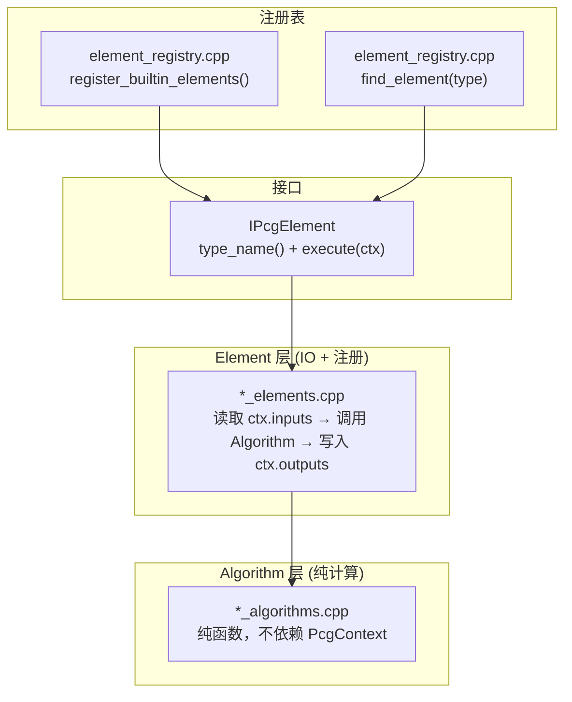

# 节点系统：IPcgElement 接口与 Element/Algorithm 分离

> [返回目录](index.md) | 前置：[数据模型](04-data-model.md) | 基于 commit `f50d744`

## 学习目标
读完并完成实践后，你能够：
- 解释 IPcgElement 接口和注册机制
- 理解 Element/Algorithm 分离模式的设计理由
- 列出内置节点类型及其分类

## 1. 从失败场景开始

在 `node-manifest.json` 中定义了一个新节点类型 `"MyCustomNode"`，但在执行图时收到 `PCG_ERR_UNKNOWN_NODE, "Unknown node type: \"MyCustomNode\""`。

根因：manifest 定义了节点的 UI 元数据，但 C++ 核心通过 `element_registry.cpp` 的 `register_builtin_elements()` 判断节点类型是否可用。manifest 中新增节点类型不会自动注册到 C++——必须在代码中实现 `IPcgElement` 子类并注册。证据：E-024, E-036。

## 2. 心智模型

节点系统是 Element/Algorithm 分离模式：每个节点类型由两个文件实现。



## 3. 原理与推导

### 3.1 IPcgElement 接口

```cpp
class IPcgElement {
public:
    virtual ~IPcgElement() = default;
    virtual const char* type_name() const = 0;
    virtual PcgResultCode execute(PcgContext& ctx) const = 0;
};
```

来源：`elements/pcg_element.hpp`，commit `f50d744`。证据：E-023。

只有两个方法：
- `type_name()`：返回节点类型名（如 `"SpawnPoints"`），用于注册和查找
- `execute(ctx)`：执行节点逻辑，从 `ctx.inputs` 读取输入，写入 `ctx.outputs`

### 3.2 注册机制

`register_builtin_elements()` 注册所有内置节点（证据：E-024）：

```cpp
void register_builtin_elements() {
    auto& map = registry();
    if (!map.empty()) return;    // 幂等：已注册则跳过

    map.emplace("SpawnPoints", std::make_unique<SpawnPointsElement>());
    map.emplace("PlaceInScene", std::make_unique<PlaceInSceneElement>());
    map.emplace("Output", std::make_unique<OutputElement>());
    register_phase41_elements(map);
    register_phase42_elements(map);
    register_mesh_elements(map);
    register_geometry_elements(map);
    register_boolean_elements(map);
    register_mesh_scatter_elements(map);
    register_spline_elements(map);
    register_spline_mesh_elements(map);
    register_material_elements(map);
    register_uv_elements(map);
}
```

来源：`element_registry.cpp`，commit `f50d744`。

**幂等设计**：`if (!map.empty()) return` 确保多次调用不会重复注册。`execute_graph()` 每次执行都调用 `register_builtin_elements()`，但只在首次实际注册。

### 3.3 Element/Algorithm 分离

| 层 | 文件 | 职责 | 依赖 |
|----|------|------|------|
| Element | `*_elements.cpp` | 注册、从 ctx 读取输入、调用 Algorithm、写入 outputs | PcgContext, Algorithm |
| Algorithm | `*_algorithms.cpp` | 核心计算（纯函数） | 仅数据类型 |

**分离的理由**（证据：D-002, E-026）：
- Algorithm 可独立测试，不需要构造 PcgContext
- Element 专注于 IO 格式转换，Algorithm 专注于算法逻辑
- 同一 Algorithm 可被多个 Element 复用

配对示例：
- `mesh_elements.cpp` + `mesh_algorithms.cpp`（CreateBoxMesh, SubdivideMesh, BevelMesh 等）
- `geometry_elements.cpp` + `geometry_algorithms.cpp`（GroupCreate, GroupCombine）
- `spline_elements.cpp` + `spline_algorithms.cpp`（CreateSpline, ResampleSpline）
- `spline_mesh_elements.cpp` + `spline_algorithms.cpp`（SweepAlongSpline, ExtrudeAlongSpline）
- `structural_elements.cpp` + `structural_algorithms.cpp`（ConvexHull, Delaunay, MST 等）
- `boolean_elements.cpp` + `geometry/boolean_csg.cpp`（BooleanMesh）
- `material_elements.cpp` + `material_algorithms.cpp`（VertexColor, AssignMaterial）
- `uv_elements.cpp` + `uv_algorithms.cpp`（UVTexture, ProjectTexture）
- `mesh_scatter_elements.cpp` + `mesh_scatter_algorithms.cpp`（SampleMeshSurface, StaticMeshSpawner）
- `primitive_elements.cpp`（SpawnPoints, PlaceInScene, Output — 简单节点，无独立 Algorithm）

### 3.4 内置节点类型

| 类别 | 节点类型 | 证据 |
|------|----------|------|
| Generation | SpawnPoints, CreatePointGrid, CreatePoints, SurfaceSampler, SampleMeshSurface | E-025 |
| Spawner | PlaceInScene, StaticMeshSpawner | E-025 |
| Filter | DensityFilter, AttributeFilter | E-025 |
| Transform | TransformPoints, ProjectPoints | E-025 |
| Metadata | CopyAttributes, DeleteAttributes, BreakAttributes | E-025 |
| Sampler | GetTerrainData, SampleSurface | E-025 |
| Structural | ConvexHull, ConnectNearest, Delaunay, MST, Voronoi, AStarPathfinding | E-025 |
| Mesh | CreateBoxMesh, CreateCylinderMesh, SubdivideMesh, BevelMesh, MeshNoiseDeform, TransformMesh, MergeMesh, RevolveMesh | E-025 |
| Geometry | GroupCreate, GroupCombine | E-025 |
| Spline | CreateSpline, GetSplineData, ResampleSpline, SampleAlongSpline, SweepAlongSpline, ExtrudeAlongSpline, CrossSectionProfile, InstanceAlongSpline, CreateSpiralSpline | E-025 |
| Boolean | BooleanMesh | E-025 |
| Material | VertexColor, AssignMaterial | E-025 |
| UV | UVTexture, ProjectTexture | E-025 |
| Texture | ImageTexture | E-025 |
| Input | GetMeshData, GetSplineData | E-025 |
| Output | Output | E-025 |

### 3.5 SpawnPointsElement 实现分析

SpawnPoints 是最简单的节点之一（证据：E-027）：

```cpp
class SpawnPointsElement final : public IPcgElement {
public:
    const char* type_name() const override { return "SpawnPoints"; }

    PcgResultCode execute(PcgContext& ctx) const override
    {
        int count = ctx.node->data.value("count", 100);
        if (count < 0) count = 0;
        if (count > 10000) count = 10000;
        const double radius = ctx.node->data.value("radius", 10.0);

        uint32_t rng = static_cast<uint32_t>(ctx.graph_seed) ^
                       static_cast<uint32_t>(ctx.graph_seed * 2654435761u);

        data::PcgPointData points;
        for (int i = 0; i < count; ++i) {
            rng = rng * 1664525u + 1013904223u;
            const double t = (count <= 1) ? 0.0 : static_cast<double>(i) / count;
            const double angle = t * 2.0 * kPi + (rng % 1000) / 1000.0 * 0.25;
            rng = rng * 1664525u + 1013904223u;
            const double radial = radius * (0.25 + (rng % 1000) / 1000.0 * 0.75);

            points.add_point(data::PcgPoint{
                radial * std::cos(angle), 0.0, radial * std::sin(angle),
            });
        }

        ctx.outputs.add_points("out", std::move(points));
        return PCG_OK;
    }
};
```

来源：`element_registry.cpp`，commit `f50d744`。

关键点：
- 参数从 `ctx.node->data` 读取（JSON value with default）
- count 限制在 0-10000
- LCG 随机数：`rng = rng * 1664525u + 1013904223u`（标准 LCG 常数）
- seed 来自 `ctx.graph_seed`，确保确定性
- 输出通过 `ctx.outputs.add_points("out", ...)` 写入

### 3.6 OutputElement (Pass-through)

Output 节点是 pass-through，按优先级转发输入（证据：E-028）：

```
Geometry > Mesh > Points > Spline > JSON
```

也转发 `spawnMesh`（如果存在）。

## 4. 映射到当前源码

### 4.1 注册路径

| 顺序 | 符号 | 职责 | 证据 |
|------|------|------|------|
| 1 | `register_builtin_elements()` | 注册所有内置节点 | E-024 |
| 2 | `find_element(type)` | 按类型查找 Element | E-024 |
| 3 | `is_known_element_type(type)` | 判断类型是否注册 | E-024 |
| 4 | `element->execute(ctx)` | 执行节点逻辑 | E-023 |

### 4.2 Element/Algorithm 文件对应

| Element 文件 | Algorithm 文件 | 节点类型 |
|--------------|---------------|----------|
| `primitive_elements.cpp` | (无) | SpawnPoints, PlaceInScene, Output |
| `mesh_elements.cpp` | `mesh_algorithms.cpp` | CreateBoxMesh, SubdivideMesh, BevelMesh, etc. |
| `geometry_elements.cpp` | `geometry_algorithms.cpp` | GroupCreate, GroupCombine |
| `spline_elements.cpp` | `spline_algorithms.cpp` | CreateSpline, ResampleSpline |
| `spline_mesh_elements.cpp` | `spline_algorithms.cpp` (shared) | SweepAlongSpline, ExtrudeAlongSpline |
| `structural_elements.cpp` | `structural_algorithms.cpp` | ConvexHull, Delaunay, MST, etc. |
| `boolean_elements.cpp` | `geometry/boolean_csg.cpp` | BooleanMesh |
| `material_elements.cpp` | `material_algorithms.cpp` | VertexColor, AssignMaterial |
| `uv_elements.cpp` | `uv_algorithms.cpp` | UVTexture, ProjectTexture |
| `mesh_scatter_elements.cpp` | `mesh_scatter_algorithms.cpp` | SampleMeshSurface, StaticMeshSpawner |

## 5. 边界、失败与恢复

| 场景 | 代码行为 | 可观察信号 | 根因 | 恢复/排查 | 证据 |
|------|----------|------------|------|-----------|------|
| 未注册节点类型 | 返回 `PCG_ERR_UNKNOWN_NODE` | "Unknown node type" | Element 未注册 | 在 registry 中注册 | E-024 |
| 参数缺失 | 使用默认值 | 行为与预期不同 | data 中缺少参数 | 检查 manifest 默认值 | E-027 |
| 输入为空 | 返回 `PCG_ERR_EXECUTION` | "missing input" | 上游未连接 | 检查边连接 | E-028 |
| count 超限 | 被截断 | 点数不是预期值 | count > 10000 | 调整参数 | E-027 |
| manifest 未定义但已注册 | C++ 执行正常，编辑器无 UI | 编辑器中找不到节点 | manifest 缺失 | 在 manifest 中添加定义 | E-036 |

## 6. 动手实践

### 6.1 目标
阅读 SpawnPointsElement 实现，理解 execute() 的输入输出流程。

### 6.2 前置条件
- 源码可读

### 6.3 步骤
1. 打开 `pcg-core/src/elements/element_registry.cpp`
2. 找到 `SpawnPointsElement` 类
3. 追踪 `execute()` 方法：读取参数 → 生成点 → 写入输出
4. 找到 `OutputElement` 类，理解 pass-through 逻辑

### 6.4 预期结果
- 理解 `ctx.node->data.value("count", 100)` 如何从 JSON 读取参数
- 理解 `ctx.outputs.add_points("out", ...)` 如何写入输出
- 理解 OutputElement 的优先级转发逻辑

## 7. 自检

1. `register_builtin_elements()` 的幂等设计是如何实现的？为什么需要幂等？
2. Element/Algorithm 分离的主要好处是什么？
3. `SpawnPointsElement` 的随机数生成器是什么类型？为什么 seed 来自 `graph_seed`？
4. 如果在 manifest 中定义了节点但 C++ 中未注册，会发生什么？

<details>
<summary>参考答案</summary>

1. 通过 `if (!map.empty()) return` 实现——如果 static map 已有元素则直接返回。需要幂等是因为 `execute_graph()` 每次执行都调用 `register_builtin_elements()`，不应重复注册。证据：E-024。
2. Algorithm 可独立测试（不需要构造 PcgContext），Element 专注于 IO 格式转换，同一 Algorithm 可被多个 Element 复用。分离还使代码结构更清晰——算法逻辑不与 IO 代码混合。证据：D-002, E-026。
3. LCG（线性同余生成器），常数为 `rng = rng * 1664525u + 1013904223u`（标准 LCG 常数）。seed 来自 `graph_seed` 确保确定性——相同的图和 seed 总是产生相同的点分布。证据：E-027。
4. C++ 核心在 `validate_graph_structure()` 中通过 `is_known_node_type()` 检查，返回 `PCG_ERR_UNKNOWN_NODE`。manifest 是编辑器侧的 UI 元数据，C++ 核心不读 manifest，通过 `element_registry.cpp` 的注册表判断。证据：E-024, E-036。

</details>

## 8. 证据与延伸阅读
- E-023：`elements/pcg_element.hpp` — IPcgElement 接口
- E-024：`element_registry.cpp:register_builtin_elements` — 注册机制
- E-025：`element_registry.cpp` — 内置节点列表
- E-026：`elements/` 目录结构 — Element/Algorithm 分离
- E-027：`element_registry.cpp:SpawnPointsElement` — LCG 随机数
- E-028：`element_registry.cpp:OutputElement` — Pass-through 优先级

## 9. 下一步
- [06 几何内核](06-geometry-kernel.md) — 理解 BMesh、Sweep、Boolean 等核心算法
