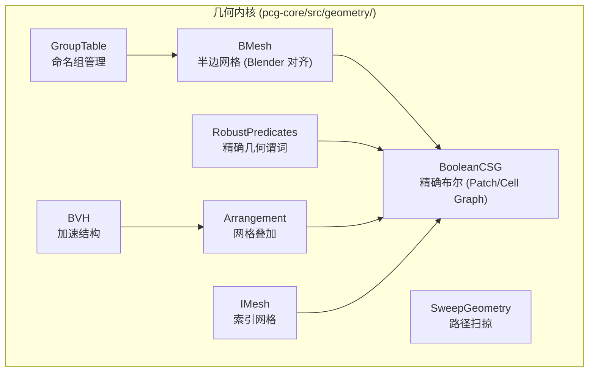

# 几何内核：BMesh、Sweep、Boolean 与 GroupTable

> [返回目录](index.md) | 前置：[节点系统](05-element-system.md) | 基于 commit `f50d744`

## 学习目标
读完并完成实践后，你能够：
- 解释 BMesh 半边数据结构如何支持 bevel 和 boolean 操作
- 描述 SweepAlongSpline 沿路径扫掠截面生成网格的流程
- 理解 Boolean CSG 的 patch/cell graph 算法路径
- 说明 GroupTable 如何管理 point/edge/face 三个 domain 的命名组

## 1. 从失败场景开始

对一个立方体执行 BevelMesh，期望边角圆润，但结果出现：

- **边界裂缝**：bevel 后某些面缺失，产生可见缝隙
- **绕序翻转**：某些面法线反向，导致渲染错误
- **n-gon 丢失**：中间三角化步骤破坏了原始面拓扑

这些问题的根因在于：bevel 操作需要精确的拓扑信息（哪些边共享面、哪些边是锐边），而三角形 soup 无法表达这些信息。这就是 BMesh 存在的理由——它提供了半边拓扑表示，使 bevel/boolean 能正确操作。证据：E-029, D-006。

## 2. 心智模型

几何内核分为四层，从内到外：



各模块职责（证据：E-029~E-034）：

| 模块 | 职责 | 输入 | 输出 |
|------|------|------|------|
| BMesh | 半边网格表示，拓扑查询 | PcgMeshData 或 PcgGeometry | BMesh (verts/faces/edges/disk_cycles) |
| SweepGeometry | 沿 backbone 路径扫掠 profile 截面 | CurveProfile + Frame3[] | PcgMeshData 或 PcgGeometry |
| BooleanCSG | 精确布尔运算 | 两个 IMesh + BooleanOp | PcgGeometry |
| GroupTable | 命名组管理 | domain + name + id | 成员集合 |
| RobustPredicates | 精确几何谓词 | Vec3 点 | OrientSign |
| BVH | 层次包围盒加速 | 三角形集 | 交集查询 |
| Arrangement | 网格叠加分割 | 两个 IMesh | 统一 IMesh |

## 3. 原理与推导

### 3.1 BMesh 半边数据结构

BMesh 是 Blender 风格的网格表示（证据：E-029, D-006）。核心结构：

```cpp
struct BMesh {
    std::vector<Vec3> verts;                        // 顶点 (double 精度)
    std::vector<BMeshFace> faces;                    // n-gon 面
    std::unordered_map<int64_t, BMeshEdge> edges;    // 边 (key = edge_key(a,b))
    std::unordered_map<int, std::vector<BMeshDiskEntry>> disk_cycles; // 顶点盘环
};
```

来源：`geometry/bmesh.hpp`，commit `f50d744`。

**BMeshFace** 存储 CCW 顶点索引列表 + 焊接三角形索引 + 所属组名集合。
**BMeshEdge** 存储两端顶点、两侧邻接面（face0/face1，-1 表示边界）、锐边标记、组名集合。
**BMeshDiskEntry** 是顶点盘环的一环——记录邻接顶点和两侧的面。

**edge_key(a, b)** 确保 a < b 的有序键：`int64_t(a < b ? a : b) << 32 | (a < b ? b : a)`。

**为什么用 double 精度**：boolean 运算需要精确的几何谓词（orient3d），float 精度不足以区分共面/几乎共面情况。证据：E-033。

### 3.2 BMesh 构建

从三角形 soup 构建 BMesh（`bmesh_from_mesh()`）：
1. **焊接顶点**：距离 < weld_eps 的顶点合并
2. **合并共面三角形**：夹角 < merge_coplanar_angle_deg 的相邻三角形合并为 n-gon
3. **标记锐边**：二面角 > sharp_angle_deg 的边标记为 sharp
4. **构建边邻接**：为每条边记录两侧面
5. **构建盘环**：为每个顶点构建有序邻接边列表

### 3.3 Sweep 沿路径扫掠

SweepGeometry 将 2D 截面沿 3D 路径扫掠生成网格（证据：E-030）。流程：

1. **准备截面**：从输入网格或参数生成 2D CurveProfile
2. **生成路径帧**：沿 backbone 样条线采样，生成 Frame3（位置 + 切线 + 法线 + 副法线）
3. **变换截面**：将截面变换到每个路径帧的局部坐标系
4. **缝合**：相邻截面之间缝合四边形面
5. **端面封口**：可选生成 cap_start / cap_end

输出为 PcgGeometry（保留 n-gon 面）或 PcgMeshData（已三角化）。

`SweepAlongFramesOptions` 控制封口、扭转、缩放等参数：

```cpp
struct SweepAlongFramesOptions {
    bool cap_start = true;
    bool cap_end = true;
    double profile_roll_radians = 0.0;
    double twist_radians = 0.0;
    double scale_start = 1.0;
    double scale_end = 1.0;
    bool profile_closed = false;
    bool backbone_closed = false;
};
```

来源：`geometry/sweep_geometry.hpp`，commit `f50d744`。

### 3.4 Boolean CSG 精确布尔

BooleanCSG 实现精确布尔运算（证据：E-031, D-006），算法路径对齐 Blender 的 mesh_boolean.cc（Zhou et al. Mesh Arrangements）：

```
两个输入网格 A, B
  → 合并为统一 IMesh (Arrangement)
    → 三角形-三角形求交（RobustPredicates）
    → 交叉分割（在交线处切分三角形）
  → 构建 Patch Graph
    → find_patches: 将共面三角形分组为 patch
    → find_cells: patch 之间的空间分区为 cell
    → find_ambient_cell: 找到外部（无穷远）cell
    → propagate_windings: BFS 从 ambient 传播 winding number
    → 标记 in_output_volume（根据 BooleanOp）
  → extract_boolean_geometry: 提取标记的 cell 面
```

**Patch** 是共面三角形的集合，记录 cell_above 和 cell_below。
**Cell** 是空间区域，记录所属 patches 和 per-operand winding numbers。

**winding number** 表示每个操作数网格对 cell 的包围次数——0 在外部，1 在内部，2 在嵌套内部。

**BooleanOp** 包括 Union、Intersect、Subtract、Shatter。

来源：`geometry/boolean_csg.hpp`，commit `f50d744`。

### 3.5 GroupTable 命名组

GroupTable 管理 point/edge/face 三个 domain 的命名组（证据：E-032）：

```cpp
enum class GroupDomain { Point, Edge, Face };

class GroupTable {
    // 按 domain 分存储 group_name → member_set
    GroupMap point_groups_;
    GroupMap edge_groups_;
    GroupMap face_groups_;
};
```

**edge key 编码**：edge 用 vertex pair `(a, b)` 编码为 `int64_t(a) * 1000000 + b`，其中 a < b。这在 `build_group_stats()` 中被解码为两个顶点坐标。证据：E-032, E-015。

**支持的操作**：add/remove/contains/union_into/intersect_into/subtract_into/eval（表达式解析）/merge_from（合并另一个 GroupTable，可选前缀避免名称冲突）。

### 3.6 RobustPredicates 精确谓词

RobustPredicates 基于 Shewchuk 的自适应精确浮点算法（证据：E-033），提供：

- `orient2d(a, b, c)`：2D 方向测试（三角形 abc 的有符号面积符号）
- `orient3d(a, b, c, d)`：3D 方向测试（四面体 abcd 的有符号体积符号）
- `orient3d_fast(a, b, c, d)`：快速非自适应版本，用于宽相拒绝
- `tri_tri_intersect(tri_a, tri_b)`：三角形-三角形精确求交

这些谓词是 Boolean CSG 的基础——需要精确判断点是否在平面上、两条线段是否相交，否则会产生拓扑错误。

来源：`geometry/robust_predicates.hpp`，commit `f50d744`。

### 3.7 Loop 细分曲面

Loop 细分在 `mesh_algorithms.cpp` 中实现（证据：E-034），支持 mesh 和 geometry 输入。算法步骤：

1. 每条边生成新顶点（相邻面顶点的加权平均）
2. 旧顶点位置更新（根据邻居顶点的加权平均）
3. 每个三角形分裂为 4 个小三角形

**边界处理**：bmesh 边界环追踪通过 turn angle 计算正确处理 pinch points。

来源：commit `7080328`，`pcg-core/src/elements/mesh_algorithms.cpp`。

## 4. 映射到当前源码

### 4.1 BMesh 调用路径

| 顺序 | 符号 | 职责 | 证据 |
|------|------|------|------|
| 1 | `bmesh_from_mesh()` | 三角形 soup → BMesh | E-029 |
| 2 | `bmesh_from_geometry()` | PcgGeometry → BMesh（保留组） | E-029 |
| 3 | `geometry_from_bmesh()` | BMesh → PcgGeometry（组保留） | E-029 |
| 4 | `mesh_from_bmesh()` | BMesh → PcgMeshData（fan 三角化） | E-029 |
| 5 | `build_disk_cycles()` | 构建顶点盘环 | E-029 |

### 4.2 Bevel 关键片段

BMesh edge key 和 edge 查找（来源：`geometry/bmesh.hpp`，commit `f50d744`）：

```cpp
int64_t edge_key(int a, int b);

struct BMeshEdge {
    int v0 = 0;
    int v1 = 0;
    int face0 = -1;   // 左侧面（-1 = 边界）
    int face1 = -1;   // 右侧面（-1 = 边界）
    bool sharp = false;
    std::unordered_set<std::string> groups;
};
```

`face1 == -1` 表示边界边——bevel 操作利用这个信息确定哪些边需要处理。

### 4.3 GroupTable 关键片段

GroupTable 的 domain 分存储（来源：`geometry/group_table.hpp`，commit `f50d744`）：

```cpp
using GroupMap = std::unordered_map<std::string, std::unordered_set<int>>;

GroupMap point_groups_;
GroupMap edge_groups_;
GroupMap face_groups_;
```

`eval()` 方法支持 Houdini 风格的子集表达式：`"a"`, `"a - b"`, `"a & b"`。

### 4.4 Boolean CSG 关键结构

Patch 和 Cell 定义（来源：`geometry/boolean_csg.hpp`，commit `f50d744`）：

```cpp
struct Patch {
    std::vector<int> tris;
    int cell_above = kNoIndex;
    int cell_below = kNoIndex;
};

struct Cell {
    std::vector<int> patches;
    std::vector<int> winding;         // per-operand winding numbers
    bool in_output_volume = false;
};
```

## 5. 边界、失败与恢复

| 场景 | 代码行为 | 可观察信号 | 根因 | 恢复/排查 | 证据 |
|------|----------|------------|------|-----------|------|
| 非流形输入 | BMesh 构建可能产生 degenerate edge | 面数异常 | 输入网格有 T-junction 或重叠面 | 焊接顶点后重试 | E-029 |
| 共面布尔 | orient3d 返回 Zero | 布尔结果面数偏少 | 两个面完全共面 | 调整 weldEpsilon | E-033 |
| 闭合样条线 sweep | backbone_closed=true 时端面处理不同 | 端面缺失或重复 | capStart/capEnd 与 closed 冲突 | 闭合样条线不需要 cap | E-030 |
| Bevel 边界绕序 | opposite winding 修正 | 面法线反向 | BMeshFace 绕序在 bevel 后翻转 | `f7289d9` 修复 | E-029 |
| GroupTable UAF | GroupTable use-after-free | 崩溃 | GroupTable 引用失效 | `f7289d9` 修复 | E-032 |
| bmesh pinch point | 边界环追踪错误 | 边界环不闭合 | pinch point 处的 turn angle 计算错误 | `7080328` 修复 | E-029 |

## 6. 动手实践

### 6.1 目标
运行 bevel 和 boolean 测试，验证几何内核正确性。

### 6.2 前置条件
- 已构建 pcg-core（`scripts\build-pcg-core.ps1`）

### 6.3 步骤
```powershell
cd /path/to/PCG-AI
.\scripts\build-pcg-core.ps1 -RunTests
# 关注以下测试输出：
# test_bevel_manifold
# test_boolean
# test_boolean_bevel_chain
# test_robust_predicates
# test_tri_intersect
```

### 6.4 预期结果
- 所有测试通过（exit code 0）
- test_bevel_manifold 验证 bevel 后网格是流形的
- test_boolean 验证 union/intersect/subtract 三种操作

### 6.5 失败时检查
- 测试编译失败：检查 CDT submodule 是否初始化（`git submodule update --init`）
- orient3d 断言失败：检查 RobustPredicates 的平台兼容性

## 7. 自检

1. BMesh 的 `disk_cycles` 存储什么信息？为什么需要它？
2. Boolean CSG 的 winding number 如何确定哪些 cell 在输出体积内？
3. 为什么 GroupTable 的 edge 用 `a*1000000+b` 编码？有什么限制？
4. SweepAlongSpline 的 `backbone_closed=true` 时，capStart/capEnd 应该如何设置？

<details>
<summary>参考答案</summary>

1. `disk_cycles` 存储每个顶点的有序邻接边列表，每环记录邻接顶点 (`other_v`) 和两侧面 (`fprev`/`fnext`)。它用于 bevel 时确定顶点周围的边和面顺序，确保生成正确的几何体。证据：E-029。
2. BFS 从 ambient cell（外部空间）开始传播 winding number。对于 Subtract(A-B) 操作，输出体积是 winding[A]>0 且 winding[B]==0 的 cell。Union 是 winding[A]>0 或 winding[B]>0。Intersect 是两者都 >0。证据：E-031。
3. 用 `a*1000000+b` 将两个 int 编码为一个 int64_t key，简化 unordered_map 查找。限制是顶点索引不能超过 1000000（约 100 万），否则会产生 key 碰撞。证据：E-032。
4. `backbone_closed=true` 时样条线是闭合环路，没有端点，因此 capStart 和 capEnd 应为 false。设置 true 会导致多余的端面。证据：E-030, commit `7080328` 修复了闭合 backbone 的端面生成。

</details>

## 8. 证据与延伸阅读
- E-029：`geometry/bmesh.hpp` — BMesh 半边结构
- E-030：`geometry/sweep_geometry.hpp` — Sweep 扫掠
- E-031：`geometry/boolean_csg.hpp` — Boolean CSG
- E-032：`geometry/group_table.hpp` — GroupTable 命名组
- E-033：`geometry/robust_predicates.hpp` — Shewchuk 精确谓词
- E-034：`elements/mesh_algorithms.cpp` — Loop 细分
- [Shewchuk 1997](https://www.cs.cmu.edu/~quake/robust.html) — Adaptive Precision Floating-Point Arithmetic
- [Blender mesh_boolean.cc](https://projects.blender.org/blender/blender) — Mesh Arrangements for Boolean CSG

## 9. 下一步
- [07 Unity 运行时](07-unity-runtime.md) — 理解 C++ 结果如何在 Unity 中被解析和渲染
