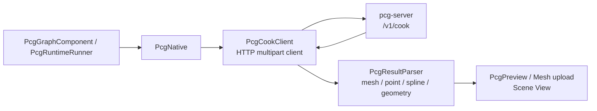

# Unity 运行时：HTTP cook 客户端、结果解析与预览渲染

> [返回目录](index.md) | 前置：[几何内核](06-geometry-kernel.md)

Unity 不再加载 `PcgCore` 原生插件。所有 C++ cook 都通过本机 `pcg-server` 的 HTTP API 执行；Unity 只负责请求、解析响应和显示结果。服务端的构建与启动方式见 [`../pcg-server.md`](../pcg-server.md)。

## 学习目标

读完并完成实践后，你能够：

- 追踪 `PcgCookClient → pcg-server → PcgResultParser` 的 cook 路径。
- 判断服务端不可用、协议不匹配和结果解析失败的位置。
- 理解 Editor 与 Player 对外部服务端的不同约束。

## 1. 从失败场景开始

在 Unity 中执行图后，Scene 视图没有任何预览，Console 报错类似：

```
pcg-server request failed: ... Connection refused
```

这表示 HTTP 客户端无法连到服务端，通常是本机 `pcg-server` 未启动。运行 `./scripts/run-pcg-server.sh`，再用 **PCG → Server → Health Check** 验证连接。

## 2. 心智模型



`PcgNative` 是兼容现有调用方的 C# 门面，不是 P/Invoke 绑定。`PcgCookClient` 向 `http://127.0.0.1:17890` 发送 `multipart/form-data` 请求；服务器返回 `application/x-pcg-cook-result-v1` 二进制载荷，客户端解包后由结果解析器和预览组件消费。

## 3. 请求与响应

### 3.1 Cook 请求

`PcgCookClient.ExecuteGraph()` 把以下内容提交给 `POST /v1/cook`：

- `meta`：seed、API 版本和请求标识。
- `graph`：待执行的 graph JSON。
- 可选纹理、Mesh、Spline 和 HeightField 上传数据。

`PcgCookClient.TryHealthCheck()` 请求 `GET /v1/health`；图校验使用 `POST /v1/validate`。这两个入口适合在执行前确认“端口可达”和“图契约可接受”是两件不同的事。

### 3.2 响应解析

服务器完成 C++ 执行后返回带 magic 和版本的 cook 结果。`PcgCookClient` 解包为 `PcgGraphExecuteResult`，随后 `PcgResultParser` 按结果类型解析：

| 结果 | 消费者 | 用途 |
|---|---|---|
| Mesh binary | `TryParseMeshBinary()` | 创建 Unity Mesh 并交给预览 |
| Point JSON/binary | `TryParsePoints()` | 点云和散布预览 |
| Spline JSON | `TryParseSplines()` | 样条预览 |
| Geometry binary | geometry parser | polygon wireframe 与拓扑保真预览 |

二进制 magic 或版本不匹配时，不要检查 DLL 路径；应核对 Unity 客户端与正在运行的 `pcg-server` 是否由兼容的源码构建。

## 4. Cook 生命周期

`PcgGraphComponent` 在 Editor 中管理加载、参数变化、异步 cook 和预览更新：

```text
OnEnable → 加载 GraphAsset → 参数或文件变化
  → RequestPreviewCook → PcgNative → PcgCookClient → pcg-server
  → PcgResultParser → 更新 Mesh / Points / Geometry preview
OnDisable → 取消本地等待任务并清理预览
```

连续修改时，组件用 generation 计数丢弃过期的异步结果，避免旧响应覆盖较新的预览。取消请求同样发到服务端；当前服务端取消为 best-effort，不能把它当作每个客户端独立的强隔离操作。

## 5. Editor 与 Player

| 环境 | 服务端地址 | 支持状态 |
|---|---|---|
| Unity Editor | 可在 **PCG → Settings** 配置；默认 `http://127.0.0.1:17890` | 支持，先运行 `pcg-server` 并通过 Health Check |
| Player / IL2CPP | 固定默认地址 `http://127.0.0.1:17890` | 仅支持已在同机运行的外置 `pcg-server`；不会静态链接、随包复制或自动启动服务端 |

`PcgRuntimeRunner` 会从 `StreamingAssets/pcg/` 读取已经 bake 为 self-contained v2 的图；它拒绝仍含 authoring v3 或外部 Subgraph Asset 的输入。Player 没有服务端 URL 配置入口，因此发布前必须确认 sidecar 服务进程、端口和安全边界；目前不应把它当作离线或自包含 cook 方案。

## 6. 故障定位

| 现象 | 首先检查 | 修复方向 |
|---|---|---|
| `Connection refused` | 服务端是否启动，Health Check 是否成功 | 启动 `pcg-server`，核对端口 |
| HTTP 非 2xx | 服务端返回体与日志 | 修复 graph 或上传数据，再重试 |
| `Unexpected response Content-Type` / magic 错误 | Unity 和 server 的构建版本 | 用同一版本源码重建、重启 server |
| 预览没有变化 | 当前 graph 是否被加载、结果类型和 Parser 日志 | 检查 graph 输入、cook 输出与 Preview 组件 |
| Player 失败 | 是否有同机 server，图是否为 baked v2 | 部署 sidecar server，或在 Editor 预烘焙结果 |

## 7. 动手实践

1. 在仓库根目录运行 `./scripts/build-pcg-server.sh`，然后运行 `./scripts/run-pcg-server.sh`。
2. 用 Unity Hub 打开 `Unity/`，执行 **PCG → Server → Health Check**。
3. 选择 **PCG → Run Graph from File…**，打开 `schema/example.pcg`。
4. 观察 Console 和 Scene View：请求成功后应看到相应的 Preview 内容。
5. 停止服务端后再次运行同一图，确认 Console 报 HTTP 连接错误；重启服务端并重复 Health Check 后恢复。

## 8. 自检

1. Unity 的 C++ cook 请求由哪个类发送？
2. Player 是否包含或静态链接 `PcgCore`？
3. 二进制结果解析失败时，为什么不应先排查 `DllNotFoundException`？

<details>
<summary>参考答案</summary>

1. `PcgCookClient` 发送 HTTP 请求，`PcgNative` 是其 C# 门面。
2. 否。Player 仅能请求同机运行的外置 `pcg-server`，且当前地址固定为默认 localhost。
3. 当前架构没有 Unity 原生绑定；应检查客户端与服务端版本、HTTP 响应和结果协议。

</details>

## 9. 下一步

- [08 Unity GraphView 编辑器](08-unity-graph-editor.md) — 理解图如何被编辑和导出。
- [09 端到端调试](09-end-to-end-debug.md) — 继续检查 Web、服务端和 Unity 的完整链路。
