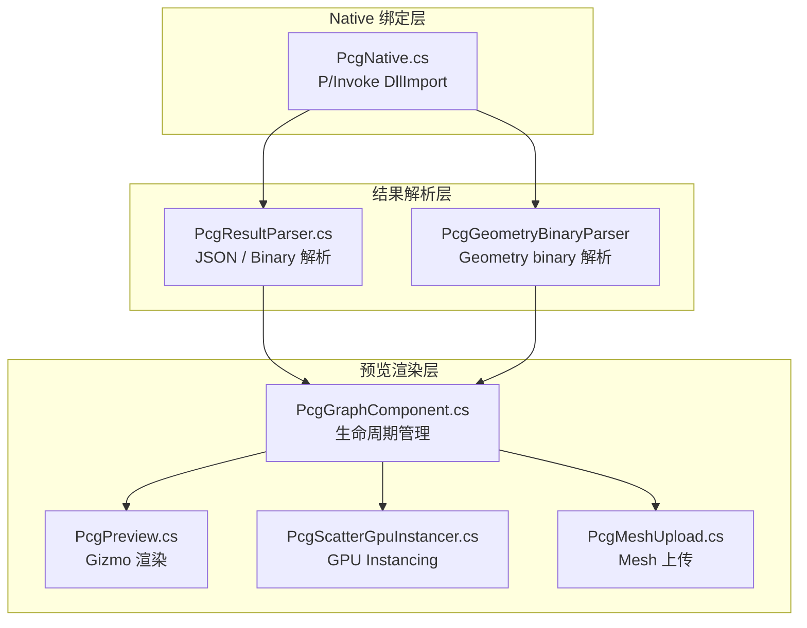

# Unity 运行时：P/Invoke 绑定、结果解析与预览渲染

> [返回目录](index.md) | 前置：[几何内核](06-geometry-kernel.md) | 基于 commit `f50d744`

## 学习目标
读完并完成实践后，你能够：
- 解释 PcgNative.cs 如何通过 P/Invoke 调用 C++ 核心
- 追踪从 native 调用到 Scene 预览渲染的完整路径
- 理解 Mesh/Point/Geometry 三种二进制结果在 C# 侧的解析方式

## 1. 从失败场景开始

在 Unity 中执行图后，Scene 视图没有任何预览。Console 报错：

```
DllNotFoundException: PcgCore
```

这是最常见的 M0 验证失败。根因是 `PcgCore.dll` 未正确放置在 `Plugins/x86_64/` 目录下，或 Unity 锁定了旧版 DLL。恢复方法：关闭 Unity → 运行 `build-pcg-core.ps1 -CopyToUnity` → 重新打开 Unity。证据：E-038。

## 2. 心智模型

Unity 运行时分为三层：**Native 绑定 → 结果解析 → 预览渲染**。



## 3. 原理与推导

### 3.1 P/Invoke 绑定

PcgNative.cs 使用 `DllImport` 调用 C++ 导出函数（证据：E-038）。平台区分：

```csharp
#if UNITY_EDITOR
    private const string Lib = "PcgCore";       // Editor: 加载 PcgCore.dll
#elif UNITY_ANDROID
    private const string Lib = "PcgCore";
#else
    private const string Lib = "__Internal";      // IL2CPP: 静态链接
#endif
```

来源：`Runtime/PcgNative.cs`，commit `f50d744`。

**Editor 模式**：动态加载 `PcgCore.dll`（Windows）或 `libPcgCore.dylib`（macOS），通过 `DllImport` 调用。
**IL2CPP 模式**：使用 `__Internal` 进行静态链接，符号直接链入 `GameAssembly.dll`，无需 DLL 文件。证据：E-047。

### 3.2 二进制常量同步

PcgNative.cs 定义与 `pcg_api.h` 相同的常量（证据：E-038）：

```csharp
public const uint MeshBinaryMagic = 0x4D474350u;
public const int MeshBinaryV2HeaderSize = 20;
public const uint MeshBinaryVersion2 = 2u;
public const uint MeshBinaryFlagHasNormals = 0x1u;
public const uint MeshBinaryFlagHasColors  = 0x2u;
public const uint MeshBinaryFlagHasUVs     = 0x4u;
public const uint PointBinaryMagic = 0x50544750u;
public const int PointBinaryHeaderSize = 16;
```

这些常量必须与 C++ 侧完全一致，否则二进制解析会失败。

### 3.3 结果解析

PcgResultParser.cs 处理三种结果类型（证据：E-039）：

**JSON 结果**：使用 `JsonUtility` 或手动解析，提取 points 数组、prefab、scale 等字段。

**Mesh Binary**：
1. 读取 20 字节 header（magic, version, vertex_count, index_count, flags）
2. 验证 magic == 0x4D474350
3. 按 flags 读取 positions、indices、可选 normals/colors/uvs
4. 构建 Unity Mesh

**Point Binary**：
1. 读取 16 字节 header（magic, version, point_count, attr_flags）
2. 验证 magic == 0x50544750
3. 按 attr_flags 读取 positions、可选 normals/uv/triIndex/scale/rotation
4. 构建 PcgScatterPoint 数组

**Geometry Binary**（v8 新增，证据：E-039, E-021）：
- 由 `PcgResultParser.cs` 中的 geometry binary 解析器处理
- 提取 n-gon 面拓扑用于 Scene View polygon wireframe preview
- 测试覆盖在 `Tests/Editor/PcgGeometryBinaryParserTests.cs`

### 3.4 PcgGraphComponent 生命周期

PcgGraphComponent 是 `MonoBehaviour`，管理图的加载、cook 和预览（证据：E-040）：

```
OnEnable → 加载 GraphAsset → 注册 EditMode cook
  → 参数变化 / 文件变化 → RequestPreviewCook
    → 同步 cook (Editor) 或 异步 cook (Task)
      → PcgNative.ExecuteGraphV8()
      → PcgResultParser 解析结果
      → 更新 Mesh / Points / Geometry preview
OnDisable → 取消 async cook → 清理
```

**Cook 模式**（`PcgCookMode`）：
- `OnParameterChange`：参数变化时自动 cook
- `Manual`：手动触发 cook

**异步 Cook**：使用 `Task<AsyncCookResult>` + `CancellationTokenSource`，避免阻塞主线程。Cook 完成后通过 generation 计数丢弃过时结果。证据：E-040。

### 3.5 预览渲染

| 预览类型 | 渲染方式 | 文件 | 证据 |
|----------|----------|------|------|
| 点云 Gizmo | `OnDrawGizmos()` 绘制青色球体 | `PcgPreview.cs` | E-040 |
| Mesh 预览 | 上传 Mesh 到 MeshFilter | `PcgMeshUpload.cs` | E-040 |
| Scatter GPU | `Graphics.DrawMeshInstanced` | `PcgScatterGpuInstancer.cs` | E-041 |
| Polygon Wire | Scene View polygon wireframe | `PcgGraphComponent.cs` | E-040 |
| Group 可视化 | 颜色编码的 group 显示 | `PcgGroupVisualizer.cs` | E-040 |

### 3.6 Cook Cache（C# 侧）

PcgGraphCookCache.cs 在 C# 侧缓存 cook 结果（证据：E-042）：

- 记录上次 cook 的参数 hash（`m_LastCookKey`）
- 记录上次 mesh binary hash（`m_LastMeshBinaryHash`）
- 参数未变时跳过 native 调用

这配合 C++ 侧的 `GraphCookCache` 形成双层缓存。

## 4. 映射到当前源码

### 4.1 Native 调用路径

| 顺序 | 符号 | 职责 | 证据 |
|------|------|------|------|
| 1 | `PcgNative.ExecuteGraphV8()` | P/Invoke 调用 `pcg_execute_graph_v8` | E-038 |
| 2 | `PcgResultParser.DetectKind()` | 判断结果类型 | E-039 |
| 3 | `PcgResultParser.ParseMeshBinary()` | 解析 Mesh 二进制 | E-039 |
| 4 | `PcgResultParser.ParsePointBinary()` | 解析 Point 二进制 | E-039 |
| 5 | `PcgGraphComponent.OnCookResult()` | 分发结果到预览 | E-040 |

### 4.2 关键片段

PcgNative.cs 的 P/Invoke 声明（来源：`Runtime/PcgNative.cs`，commit `f50d744`）：

```csharp
[DllImport(Lib, CallingConvention = CallingConvention.Cdecl, CharSet = CharSet.Ansi)]
private static extern int pcg_validate_graph(string json, StringBuilder errBuf, int errBufSize);

[DllImport(Lib, CallingConvention = CallingConvention.Cdecl, CharSet = CharSet.Ansi)]
private static extern int pcg_execute_graph_v8(
    string json, int seed,
    NativeTextureSlot[] textures, int texture_count,
    NativeMeshSlot[] meshes, int mesh_count,
    NativeSplineSlot[] splines, int spline_count,
    out int outKind,
    byte[] outJson, int outJsonSize,
    byte[] outMeshBuf, int outMeshBufSize,
    byte[] outPointsBuf, int outPointsBufSize,
    out int outPointCount, out uint outPointAttrFlags,
    out int outVertexCount, out int outIndexCount,
    out PcgCookStats outStats,
    byte[] outPerfJson, int outPerfJsonSize,
    byte[] outGeometryBuf, int outGeometryBufSize,
    out int outGeometryBytesWritten,
    StringBuilder errBuf, int errBufSize);
```

注意 `CharSet.Ansi`：JSON 字符串通过 ANSI 编码传递，不支持 Unicode 字符。

### 4.3 Mesh Binary 解析

PcgResultParser.cs 中 Mesh Binary 解析的常量定义（来源：`Runtime/PcgNative.cs`，commit `f50d744`）：

```csharp
public const uint MeshBinaryMagic = 0x4D474350u;
public const int MeshBinaryV2HeaderSize = 20;
public const uint MeshBinaryVersion2 = 2u;
public const uint MeshBinaryFlagHasNormals = 0x1u;
public const uint MeshBinaryFlagHasColors  = 0x2u;
public const uint MeshBinaryFlagHasUVs     = 0x4u;
```

这些常量与 `pcg_api.h` 中的 `PCG_MESH_BINARY_*` 宏完全对应。

### 4.4 Cook 生命周期

PcgGraphComponent.cs 的核心字段（来源：`Runtime/PcgGraphComponent.cs`，commit `f50d744`）：

```csharp
private float m_NextEditModeCookTime;
private bool m_PreviewCookPending;
private bool m_CookInProgress;
private bool m_AsyncCookInProgress;
private CancellationTokenSource m_AsyncCookCts;
private Task<AsyncCookResult> m_AsyncCookTask;
private int m_AsyncCookGeneration;
private string m_LastCookKey;
private bool m_HasAppliedCookResult;
private ulong m_LastMeshBinaryHash;
private PcgPolygonPreviewData m_PolygonPreview;
```

`m_AsyncCookGeneration` 是关键——每次发起新 cook 时递增，旧 cook 完成后检查 generation 是否匹配，不匹配则丢弃结果。

## 5. 边界、失败与恢复

| 场景 | 代码行为 | 可观察信号 | 根因 | 恢复/排查 | 证据 |
|------|----------|------------|------|-----------|------|
| DLL 未找到 | `DllNotFoundException` | Console 报错 | DLL 未复制到 Plugins | `build-pcg-core.ps1 -CopyToUnity` | E-038 |
| DLL 被锁定 | `Copy-Item` 失败 | 脚本报错 | Unity 占用 DLL | 关闭 Unity 后重拷 | E-038 |
| 二进制 magic 不匹配 | 解析返回空 | 预览为空 | C#/C++ 常量不同步 | 检查版本对齐 | E-039 |
| Buffer 太小 | native 返回 `PCG_ERR_EXECUTION` | err_buf: "buffer too small" | 点数或面数过多 | 增大 buffer | E-005 |
| 异步 cook 结果过期 | generation 不匹配，丢弃 | 预览不更新 | 快速连续修改参数 | 正常行为，等待最新 cook | E-040 |
| IL2CPP LNK2019 | 链接错误 | `LNK2019 pcg_*` | PcgCore.lib 未就绪 | `build-pcg-core.ps1 -CopyToUnity` | E-047 |

## 6. 动手实践

### 6.1 目标
验证 Web → C++ → Unity 全链路数据流。

### 6.2 前置条件
- 已构建 pcg-core 并复制 DLL
- Unity 工程可打开

### 6.3 步骤
1. 打开 Unity 工程（`Unity/` 目录）
2. **PCG → Print PcgCore Version** → 确认 Console 输出 `pcg-core 0.1.2 (bmesh-tier1)`
3. **PCG → Run Graph from File…** → 选择 `schema/example.pcg`
4. 观察 Scene 视图中的青色球体 Gizmo

### 6.4 预期结果
- Console 无错误
- Scene 视图显示 100 个青色球体（半径 10 的圆盘内）
- PCG Preview 对象出现在 Hierarchy 中

### 6.5 失败时检查
- `DllNotFoundException`：重新构建并复制 DLL
- 无 Gizmo：检查 PcgPreview 组件是否挂载
- 点数为 0：检查 graph JSON 是否正确

## 7. 自检

1. Editor 模式和 IL2CPP 模式加载 native 库的方式有什么区别？
2. PcgGraphComponent 的 `m_AsyncCookGeneration` 解决什么问题？
3. 为什么 PcgNative.cs 中定义的二进制常量必须与 `pcg_api.h` 完全一致？
4. Cook Cache 在 C# 侧和 C++ 侧各做了什么？

<details>
<summary>参考答案</summary>

1. Editor 模式使用 `DllImport("PcgCore")` 动态加载 DLL/dylib；IL2CPP 模式使用 `DllImport("__Internal")` 静态链接，符号直接链入 GameAssembly.dll，不需要 DLL 文件。证据：E-038, E-047。
2. 快速连续修改参数时，多个异步 cook 可能同时进行。`m_AsyncCookGeneration` 每次发起新 cook 时递增，旧 cook 完成后检查 generation 是否匹配——不匹配则丢弃结果，避免旧结果覆盖新结果。证据：E-040。
3. C# 侧解析二进制时使用这些常量验证 magic number 和定位 header 字段。如果常量不同步（例如 C++ 升级了 binary version 但 C# 未更新），解析会失败或产生错误数据。证据：E-038, E-019。
4. C++ 侧的 `GraphCookCache` 在 per-node 级别缓存——输入哈希未变时跳过节点执行。C# 侧的 `PcgGraphCookCache` 在整个图级别缓存——参数 hash 未变时跳过 native 调用。两层缓存互补。证据：E-011, E-042。

</details>

## 8. 证据与延伸阅读
- E-038：`Runtime/PcgNative.cs` — P/Invoke 绑定
- E-039：`Runtime/PcgResultParser.cs` — 结果解析
- E-040：`Runtime/PcgGraphComponent.cs` — 生命周期管理
- E-041：`Runtime/PcgScatterGpuInstancer.cs` — GPU Instancing
- E-042：`Runtime/PcgGraphCookCache.cs` — C# 侧 cook 缓存
- E-047：`Editor/PcgIl2CppBuildProcessor.cs` — IL2CPP 静态链接

## 9. 下一步
- [08 Unity GraphView 编辑器](08-unity-graph-editor.md) — 理解编辑器如何创建和编辑图
