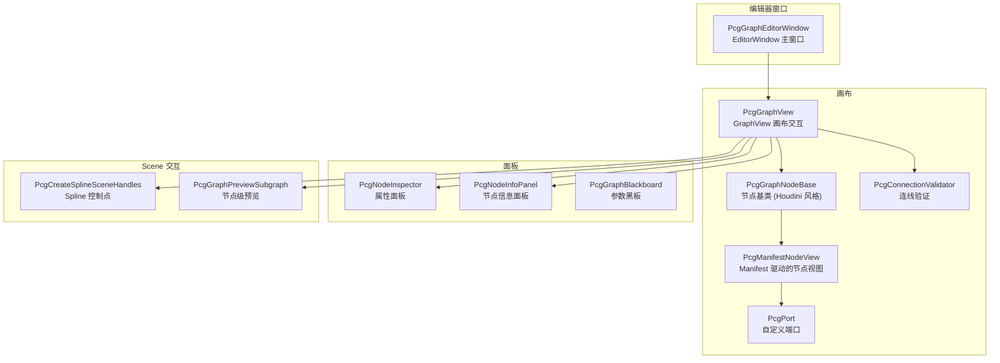

# Unity GraphView 编辑器：节点画布、Inspector 与 Scene 交互

> [返回目录](index.md) | 前置：[Unity 运行时](07-unity-runtime.md) | 基于 commit `f50d744`

## 学习目标
读完并完成实践后，你能够：
- 解释 GraphView 编辑器如何根据 node-manifest.json 动态生成节点
- 描述 PcgGraphNodeBase 的端口布局和交互设计
- 理解 Scene 视图中的 spline 控制点编辑机制

## 1. 从失败场景开始

打开 **PCG → Graph Editor** 后看不到节点面板。根因可能是：
- `.pcg` 文件未正确关联（`m_Selected` GUID 为空）
- node-manifest.json 未找到（Resources 目录缺失）
- 编译错误导致 `PcgPlugin.Editor.asmdef` 未编译

排查：检查 Console 是否有编译错误 → 确认 `Editor/Graph/node-manifest.json` 存在 → 尝试通过 **PCG → Graph Editor → Open…** 加载 `.pcg` 文件。证据：E-043。

## 2. 心智模型

Unity GraphView 编辑器替代 Web 编辑器成为主要编辑路径（证据：D-010）。它由以下组件构成：



## 3. 原理与推导

### 3.1 Manifest 驱动的节点生成

`PcgManifestNodeView` 根据 `node-manifest.json` 动态生成节点（证据：E-044）：

1. 读取 manifest 中的 `ManifestNodeDef`（类型、输入/输出 Pin、属性）
2. `BuildPorts()` 为每个 input/output pin 创建 `PcgPort`
3. `ApplyData()` 从图数据填充属性字段
4. `CollectData()` 将修改后的属性写回图数据

关键设计：节点不需要硬编码 UI——manifest 定义了属性类型（integer/number/string/enum/boolean/groupSelect 等），编辑器据此动态创建对应的 UI 控件。

### 3.2 Houdini 风格节点布局

`PcgGraphNodeBase` 继承 Unity `Node`，但视觉风格对齐 Houdini（证据：E-044）：

```csharp
internal const float NodeWidth = 92f * 2f / 3f;     // ≈ 61.3px
internal const float NodeHeight = 23f;
internal const float NodeCornerRadius = 12f;
internal const float PinSize = 14f * 2f / 3f;        // ≈ 9.3px
```

来源：`Editor/Graph/Nodes/PcgGraphNodeBase.cs`，commit `f50d744`。

**交互特性**：
- 悬停时显示径向菜单（Radial Menu）
- 双击节点进入重命名模式
- 选中时高亮边框
- 端口布局紧凑（Houdini 风格小端口）

### 3.3 连线验证

`PcgConnectionValidator` 验证连线合法性（证据：E-045）：
- pinType 必须兼容（如 `SpatialPoint` 不能连接到 `SpatialMesh`）
- 不允许自环
- 不允许重复连接

### 3.4 Scene 视图 Spline 编辑

`PcgCreateSplineSceneHandles` 在 Scene 视图中为 `CreateSpline` 节点创建可拖拽的控制点（证据：E-046）：

1. 检测当前选中节点是否是 spline 类型
2. 从节点 data 中读取控制点坐标
3. 使用 `Handles.PositionHandle` 绘制可拖拽的 3D handle
4. 拖拽时实时更新节点 data 并触发 cook

**编辑模式管理**（证据：E-045）：

```csharp
public enum SceneEditLevel { Object, Component }
public enum SceneEditDomain { None, SplineControlPoint, Vertex, Edge, Face }
```

Scene 编辑支持多个 domain——spline 控制点、几何顶点、边、面。`PcgSceneEditContext` 携带当前激活的 domain 和节点 ID。

### 3.5 节点级预览

`PcgGraphPreviewSubgraph` 构建 Houdini 风格的 per-node 预览（证据：E-045）：

1. 从目标节点 BFS 向上搜索所有上游节点
2. 构建子图，将目标节点连接到合成的 Output sink
3. 执行子图，获取该节点的几何输出
4. 在 Scene 视图绘制 polygon wireframe

关键常量：`PreviewSinkNodeId = "__pcg_preview_sink__"`。

### 3.6 文件监视与自动重载

`PcgGraphEditorWindow` 使用 `FileSystemWatcher` 监视 `.pcg` 文件变化（证据：E-043）：

```csharp
private FileSystemWatcher _fileWatcher;
private bool _pendingExternalReload;
private DateTime _lastWriteUtc = DateTime.MinValue;
private DateTime _lastSelfSaveUtc = DateTime.MinValue;
private const double SelfSaveIgnoreSeconds = 1.0;
```

- 文件被外部修改时触发 `_pendingExternalReload`
- 自身保存后 1 秒内的写入事件被忽略（避免自我触发）
- 这使得 Web 编辑器 **Send to Unity** 能自动触发 GraphView 重载

### 3.7 Undo/Redo

`PcgGraphUndoRedoBridge` 集成 Unity Undo 系统（证据：E-045）：
- 节点添加/删除、连线、属性修改都记录到 Undo 栈
- `m_SuppressUndo` 标志用于批量操作时暂时禁用 Undo 记录

## 4. 映射到当前源码

### 4.1 编辑器打开流程

| 顺序 | 符号 | 职责 | 证据 |
|------|------|------|------|
| 1 | `PcgGraphEditorWindow.ShowWindow()` | 打开编辑器窗口 | E-043 |
| 2 | `PcgGraphEditorWindow.OnEnable()` | 初始化 GraphView + 加载 manifest | E-043 |
| 3 | `PcgGraphView.LoadDocument()` | 加载 .pcg 文件 | E-045 |
| 4 | `PcgGraphNodeFactory.CreateNode()` | 根据 type 创建 PcgManifestNodeView | E-044 |
| 5 | `PcgManifestNodeView.BuildPorts()` | 从 manifest 生成端口 | E-044 |

### 4.2 关键片段

PcgManifestNodeView 的端口构建（来源：`Editor/Graph/Nodes/PcgManifestNodeView.cs`，commit `f50d744`）：

```csharp
protected override void BuildPorts()
{
    foreach (var pin in _def.inputs)
    {
        var port = CreatePort(Direction.Input, pin.id, pin.label, pin.pinType, pin.variadic);
        _inputPorts[pin.id] = port;
        inputContainer.Add(port);
    }

    foreach (var pin in _def.outputs)
    {
        var port = CreatePort(Direction.Output, pin.id, pin.label, pin.pinType);
        port.userData = pin.id;
        _outputPorts[pin.id] = port;
        OutputPort = port;
        outputContainer.Add(port);
    }
}
```

`_def.inputs` 和 `_def.outputs` 直接来自 `node-manifest.json` 的解析结果。manifest 中新增一个 pin 定义，编辑器自动生成对应端口——这就是 SSOT 的力量。

### 4.3 GraphView 交互

PcgGraphView 继承 `GraphView`（来源：`Editor/Graph/PcgGraphView.cs`，commit `f50d744`）：

```csharp
public sealed class PcgGraphView : GraphView
{
    private readonly PcgGraphSearchWindow m_SearchWindow;
    private PcgGraphState m_State;
    private int m_EdgeCounter = 100;
    private EditorWindow m_HostWindow;
    // ...
}
```

支持的操作：
- 右键空白处打开节点搜索面板（`PcgGraphSearchWindow`）
- 从端口拖拽创建连线
- 拖拽节点移动位置
- 选中节点后显示 Inspector 和 Info Panel
- 节点悬停显示径向菜单（预览、删除等操作）

## 5. 边界、失败与恢复

| 场景 | 代码行为 | 可观察信号 | 根因 | 恢复/排查 | 证据 |
|------|----------|------------|------|-----------|------|
| Manifest 未找到 | 节点列表为空 | 搜索面板无选项 | Resources 目录缺失 | 检查 node-manifest.json 位置 | E-044 |
| .pcg 格式错误 | 加载失败 | Console 报 JSON 解析错误 | 手动编辑 .pcg 出错 | 用 Web 编辑器重新导出 | E-043 |
| Spline handle 不显示 | Scene 视图无 handle | 无法编辑控制点 | 节点未选中或不是 spline 类型 | 选中 CreateSpline 节点 | E-046 |
| 预览过时 | Scene wire 不匹配 | 预览与图不一致 | cook 未完成或被取消 | 手动触发 Reload | E-045 |
| FileWatcher 误触发 | 图频繁重载 | 编辑器卡顿 | 自身保存被识别为外部修改 | SelfSaveIgnoreSeconds 阈值 | E-043 |

## 6. 动手实践

### 6.1 目标
在 GraphView 中创建一个 SpawnPoints → Output 图并执行预览。

### 6.2 前置条件
- Unity 工程已打开，pcg-core 已构建

### 6.3 步骤
1. **PCG → Graph Editor** 打开编辑器
2. 右键画布 → 搜索 `SpawnPoints` → 添加节点
3. 右键画布 → 搜索 `Output` → 添加节点
4. 从 SpawnPoints 的 `out` 端口拖拽到 Output 的 `in` 端口
5. 选中 SpawnPoints 节点，在 Inspector 中调整 `count` 和 `radius`
6. 点击工具栏的 Run 按钮（或保存后自动 cook）

### 6.4 预期结果
- 节点和连线正确显示
- Scene 视图显示预览 Gizmo 或 mesh
- 保存后 `.pcg` 文件包含正确的 JSON

### 6.5 失败时检查
- 节点搜索无结果：检查 manifest 加载
- 连线被拒绝：检查 pinType 兼容性
- 无预览：检查 PcgGraphComponent 是否挂载

## 7. 自检

1. `PcgManifestNodeView` 如何从 `node-manifest.json` 生成端口？
2. `PcgGraphPreviewSubgraph` 的作用是什么？它如何构建子图？
3. `FileSystemWatcher` 的 `SelfSaveIgnoreSeconds` 解决什么问题？
4. Scene 编辑中 `SceneEditDomain` 有哪些值？分别对应什么交互？

<details>
<summary>参考答案</summary>

1. `BuildPorts()` 遍历 `_def.inputs` 和 `_def.outputs`（从 manifest 解析的 `ManifestNodeDef`），为每个 pin 调用 `CreatePort()` 创建对应方向的 PcgPort，添加到 inputContainer/outputContainer。manifest 中新增 pin 定义，编辑器自动生成端口。证据：E-044。
2. `PcgGraphPreviewSubgraph` 构建 Houdini 风格的 per-node 预览——从目标节点 BFS 向上搜索所有上游节点，构建子图并接入合成的 Output sink (`__pcg_preview_sink__`)，执行子图获取该节点的几何输出，在 Scene 视图绘制 polygon wireframe。证据：E-045。
3. `FileSystemWatcher` 监视文件变化时无法区分外部修改和自身保存。`SelfSaveIgnoreSeconds = 1.0` 在自身保存后 1 秒内忽略文件变更事件，避免自我触发重载。证据：E-043。
4. `SceneEditDomain` 有 None、SplineControlPoint、Vertex、Edge、Face 五个值。SplineControlPoint 对应 spline 控制点拖拽，Vertex/Edge/Face 对应几何体的顶点/边/面选择和编辑。证据：E-045, E-046。

</details>

## 8. 证据与延伸阅读
- E-043：`Editor/Graph/PcgGraphEditorWindow.cs` — 编辑器窗口
- E-044：`Editor/Graph/Nodes/PcgManifestNodeView.cs` — Manifest 驱动节点
- E-045：`Editor/Graph/PcgGraphView.cs` — 画布交互
- E-046：`Editor/Graph/PcgCreateSplineSceneHandles.cs` — Scene spline 编辑
- E-047：`Editor/PcgIl2CppBuildProcessor.cs` — 构建时确认不执行原生核心链接

## 9. 下一步
- [09 端到端调试与验证](09-end-to-end-debug.md) — 全链路联调、Web 编辑器、构建与 CI
