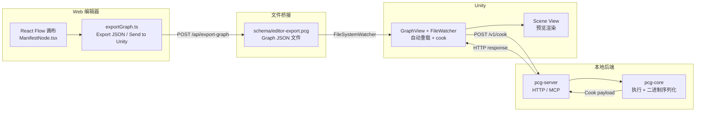

# 端到端调试与验证：全链路、Web 编辑器、构建与 CI

> [返回目录](index.md) | 前置：[Unity GraphView 编辑器](08-unity-graph-editor.md) | 基于 commit `f50d744`

## 学习目标
读完并完成实践后，你能够：
- 完成从 Web 编辑到 Unity 预览的端到端验证
- 使用 ctest 和构建脚本验证 C++ 核心
- 诊断全链路常见故障

## 1. 从失败场景开始

**场景**：在 Web 编辑器中点击 **Send to Unity**，但 Unity 的 GraphView 没有更新。

排查路径：
1. Web 终端是否显示 `Saved to schema/editor-export.pcg`？→ 否：dev server 未运行
2. Unity GraphView 是否打开了 `schema/editor-export.pcg`？→ 否：需 **PCG → Set Watched Graph…**
3. FileWatcher 是否检测到变化？→ 否：检查文件路径权限
4. cook 是否成功执行？→ 否：检查 Console 错误

这个场景展示了端到端调试的核心思路：**沿数据流逐段验证**。证据：E-051。

## 2. 心智模型

端到端数据流涉及四个子系统：



## 3. Web 编辑器

### 3.1 架构

Web 编辑器是一个独立的 Vite + React 子工程（证据：E-048）：

| 文件 | 职责 |
|------|------|
| `App.tsx` | 主应用、画布布局 |
| `nodes/ManifestNode.tsx` | Manifest 驱动的节点组件 |
| `nodes/useNodeData.ts` | 节点数据 hook |
| `graphSchema.ts` | TS 类型定义 |
| `exportGraph.ts` | 导出 JSON / Send to Unity |
| `importGraph.ts` | 导入 JSON |
| `connectionValidation.ts` | 连线验证 |
| `Inspector.tsx` | 属性面板 |
| `NodeInfoPanel.tsx` | 节点信息 |
| `NodeSearchPanel.tsx` | 节点搜索 |
| `useUndoRedo.ts` | 撤销/重做 |
| `nodeManifest.ts` | Manifest 加载 |
| `groupResolver.ts` | 组解析 |
| `Blackboard.tsx` | 参数黑板 |

### 3.2 Manifest 驱动

`ManifestNode.tsx` 根据 `node-manifest.json` 动态渲染节点（证据：E-049）：
- 读取 manifest 定义
- 渲染输入/输出端口
- 渲染属性编辑控件
- 使用 React Flow 的自定义节点 API

### 3.3 Send to Unity 机制

`exportGraph.ts` 提供两种导出方式（证据：E-051）：

**Export JSON**：将图 JSON 下载为 `.pcg` 文件到本机。不依赖 dev server。

**Send to Unity**：开发模式下，Vite 插件暴露 `POST /api/export-graph`，将 JSON 写入仓库内 `schema/editor-export.pcg`。生产构建不包含此 API。

```typescript
// 伪代码，非仓库源码
async function sendToUnity(graph) {
    const response = await fetch('/api/export-graph', {
        method: 'POST',
        body: JSON.stringify(graph),
    });
    return response.json();
}
```

### 3.4 连线验证

`connectionValidation.ts` 验证连线合法性（证据：E-050）：
- pinType 兼容性检查
- 不允许重复连接
- 不允许自环

与 Unity 侧的 `PcgConnectionValidator` 逻辑对齐。

## 4. C++ 构建与测试

### 4.1 CMake 构建

`pcg-core/CMakeLists.txt` 定义构建目标（证据：E-052）：

| 构建目标 | 产物 | 用途 |
|----------|------|------|
| `PcgCore` | 平台原生核心库 | 链入服务端和 C++ 测试，不复制进 Unity |
| `pcg-server` | 本机服务端可执行文件 | 为 Web 与 Unity 提供 HTTP/MCP cook |
| CTest targets | 测试可执行文件 | 核心算法与协议回归 |

### 4.2 构建脚本

```bash
# Unity 联调：重建并启动 HTTP 后端（不要 copy dylib 到 Unity）
./scripts/build-pcg-server.sh
./scripts/run-pcg-server.sh

# 仅算法回归
./scripts/build-pcg-core.sh --run-tests
```

`--copy-to-unity` / `-CopyToUnity` 已废弃（Unity 不再加载 native plugin）。

### 4.3 CTest 测试

当前 CMake 注册了 46 个测试 target，覆盖以下模块（证据：E-055）：

| 测试文件 | 覆盖模块 |
|----------|----------|
| `test_executor.cpp` | 图执行引擎 |
| `test_cook_cache.cpp` | Cook Cache |
| `test_data.cpp` | 数据模型 |
| `test_geometry_export.cpp` | Geometry binary 导出 |
| `test_bevel_manifold.cpp` | BMesh + Bevel |
| `test_boolean.cpp` | Boolean CSG |
| `test_bvh.cpp` | BVH 加速结构 |
| `test_robust_predicates.cpp` | 精确谓词 |
| `test_tri_intersect.cpp` | 三角形求交 |
| `test_imesh.cpp` | 索引网格 |
| `test_arrangement.cpp` | 网格叠加 |
| `test_cylinder_revolve.cpp` | Revolve |
| `test_spiral_spline.cpp` | Spiral Spline |
| `test_stone_arch_bridge.cpp` | 端到端 bridge demo |
| `test_split_normals.cpp` | Split Normals |
| ... | ... |

### 4.4 本地持续验证

当前检出不包含 GitHub Actions 工作流；提交前在本地执行同等的核心构建与 CTest：

```bash
./scripts/build-pcg-core.sh --run-tests
```

在 Windows PowerShell 中使用：

```powershell
.\scripts\build-pcg-core.ps1 -RunTests
```

## 5. 端到端验证

### 5.1 验证矩阵

| 检查项 | 方法 | 预期 | 失败意味着 |
|--------|------|------|------------|
| C++ 核心 | `build-pcg-core.ps1 -RunTests` | ctest 全绿 | 编译或算法问题 |
| 服务端连接 | Unity: PCG → Server → Health Check | 显示服务健康与核心版本 | 服务未启动或地址错误 |
| JSON 验证 | pcg_validate_graph(example.pcg) | PCG_OK | 解析器问题 |
| 点生成 | Run example.pcg → Scene Gizmo | 100 个青色球体 | 执行引擎问题 |
| Mesh 生成 | Run stone-arch-bridge.pcg → Scene mesh | 桥梁网格 | 几何内核问题 |
| Web → Unity | Send to Unity → GraphView 自动重载 | 画布更新 | 文件桥接问题 |
| Player | 启动外置服务后运行 Player | cook 成功；停服时错误明确 | 服务地址或网络边界问题 |

### 5.2 故障诊断表

| 失败信号 | 可能根因 | 定位步骤 | 恢复 |
|----------|----------|----------|------|
| `Connection refused` / Health Check 失败 | `pcg-server` 未启动或端口不一致 | 检查服务日志与 Unity Server URL | 启动服务端并重新 Health Check |
| `PCG_ERR_INVALID_JSON` | Graph JSON 格式错误 | 检查 version/nodes/edges | 修正 JSON |
| `PCG_ERR_UNKNOWN_NODE` | 节点类型未注册 | 检查 type 拼写 | 修正或注册新 Element |
| `PCG_ERR_CYCLE_DETECTED` | 图中有环 | 检查 edges 方向 | 移除形成环的边 |
| `PCG_ERR_EXECUTION` | 节点执行失败 | 检查 err_buf 消息 | 根据消息定位 |
| 预览无变化 | Watched Graph 路径错误 | 检查 Settings 中的路径 | 设置正确路径 |
| Mesh 黑色 | normals 缺失 | 检查 binary flags | 确认 normal 生成 |
| Boolean 崩溃 | 非流形输入 | 检查输入网格 | 焊接顶点 |

### 5.3 发布验证

```bash
./scripts/build-pcg-server.sh
./scripts/run-pcg-server.sh
# Editor：PCG → Server → Health Check 后 cook
```

Player 本期不链入 `PcgCore`。可选：

```powershell
.\scripts\verify-release-package.ps1 -PlayerBuildPath "Build\Windows"
```

Player 当前同样通过 localhost HTTP 请求外置 `pcg-server`，不会把 `PcgCore` 静态或动态链接进包体。发布验证应同时覆盖“服务在线可 cook”和“服务离线时错误明确”两种状态。

## 6. 动手实践

### 6.1 端到端验证

**目标**：完成 Web → C++ → Unity 全链路。

**步骤**：
1. 启动 Web 编辑器：
   ```bash
   cd web/pcg-editor
   npm install    # 首次
   npm run dev
   ```
2. 浏览器打开 `http://localhost:5173`
3. 调整节点参数（如 `count: 50, radius: 5`）
4. 点击 **Send to Unity**
5. 在 Unity 中打开 GraphView，加载 `schema/editor-export.pcg`
6. 开启 Auto Reload
7. 在 Web 中修改参数 → Unity Scene 视图自动更新

**预期**：参数变化后 Unity Scene 预览实时更新。

### 6.2 C++ 测试验证

```bash
./scripts/build-pcg-core.sh --run-tests
```

**预期**：所有 ctest target 通过。

执行记录：
- 命令：`.\scripts\build-pcg-core.ps1 -RunTests`
- 环境：Windows, VS 2022, CMake 3.20+
- 验证方式：静态验证（需要构建环境）。阻塞原因：当前环境未配置 VS 2022 工具链。

## 7. 自检

1. Web 编辑器的 **Send to Unity** 在生产构建中是否可用？为什么？
2. C++ 侧和 C# 侧各有多少层 Cook Cache？它们分别缓存什么粒度？
3. Player 中为什么不包含 `PcgCore` 原生库？
4. `FileSystemWatcher` 的 `SelfSaveIgnoreSeconds` 如果设为 0 会发生什么？

<details>
<summary>参考答案</summary>

1. 不可用。`Send to Unity` 依赖 Vite dev server 的 `POST /api/export-graph` 端点，该端点仅在开发模式下存在。生产构建不包含此 API。离线场景应使用 **Export JSON** 手动保存 `.pcg` 文件，再在 Unity 中 **Run Graph from File…** 加载。证据：E-051。
2. 两层。C++ 侧的 `GraphCookCache` 在 per-node 级别缓存——节点输入哈希未变时跳过执行。C# 侧的 `PcgGraphCookCache` 在整个图级别缓存——参数 hash 未变时跳过 HTTP cook 请求。证据：E-011, E-042。
3. Unity 端不再进程内加载核心库；Editor 与 Player 都通过 localhost HTTP 请求外置 `pcg-server`。`PcgIl2CppBuildProcessor` 只记录并约束这一边界，不执行原生链接。证据：E-047。
4. 自身保存 `.pcg` 文件时 `FileSystemWatcher` 会立即检测到变化并触发重载，导致自身保存后立即被自己的写入事件触发重载，形成循环。`SelfSaveIgnoreSeconds = 1.0` 给了一个 1 秒的忽略窗口。证据：E-043。

</details>

## 8. 证据与延伸阅读
- E-048：`web/pcg-editor/package.json` — Web 编辑器依赖
- E-049：`web/pcg-editor/src/nodes/ManifestNode.tsx` — Manifest 驱动节点
- E-050：`web/pcg-editor/src/connectionValidation.ts` — 连线验证
- E-051：`web/pcg-editor/src/exportGraph.ts` — 导出机制
- E-052：`pcg-core/CMakeLists.txt` — CMake 构建
- E-053：`scripts/build-pcg-core.ps1` — 构建脚本
- E-054：`scripts/build-pcg-core.sh` 与 `scripts/build-pcg-core.ps1` — 本地构建与 CTest 入口
- E-055：`pcg-core/tests/` 与 `pcg-core/CMakeLists.txt` — CTest targets

## 9. 完成后的心智模型

回顾整个教程，PCG-AI 的完整架构：

```
Web 画布 / Unity GraphView
    ↓ Graph JSON (version 1.0, nodes + edges)
pcg-server (localhost HTTP / MCP)
    ↓ validated cook request
pcg-core
    → parse_graph: JSON → Graph 结构
    → topological_order: Kahn 排序
    → per-node execute (Element/Algorithm 分离)
        → 数据流: PcgDataCollection (Points/Geometry/Mesh/Spline/JSON)
        → 几何内核: BMesh (半边) / Sweep / Boolean CSG / GroupTable
    → Sink 检测 → 结果组装
    → write_execution_result: Binary (Mesh/Point/Geometry) 或 JSON
    ↓ versioned cook payload via pcg-server
Unity Runtime
    → PcgCookClient HTTP 请求
    → PcgNative 兼容门面
    → PcgResultParser 解析二进制
    → PcgGraphComponent 更新预览
    → Scene View: Gizmo / Mesh / Polygon Wire / GPU Instancing
```

核心设计决策：
1. **C++ 是唯一算法执行体**，各端只负责 UI 和引擎绑定
2. **对齐 UE PCG 节点模型**，但不引入 UE 依赖
3. **延迟三角化**：节点输出 n-gon Geometry，Sink 统一三角化
4. **node-manifest.json SSOT**：Web/Unity 共用同一份节点定义
5. **API additive 演进**：v1→v8 向后兼容
6. **Cook Cache 双层缓存**：C++ per-node + C# per-graph

## 10. 下一步
- 返回 [目录](index.md) 查看其他文档
- 阅读 [工程架构](../architecture.md) 了解当前组件边界
