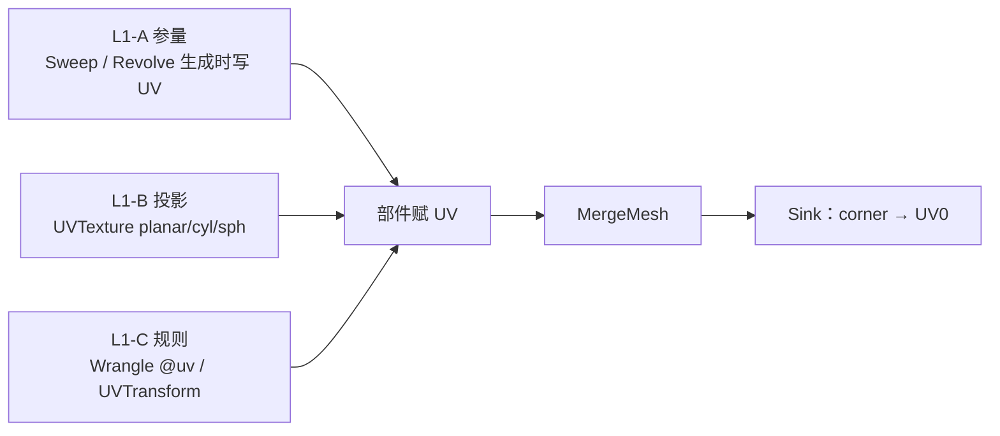

# UV Domain：对标 Houdini 的三源契约

> [返回目录](index.md) | 前置：[数据模型](04-data-model.md) | 本文不依赖仓库外的计划文件。

## 学习目标

- 区分 point UV 与 corner（vertex）UV 的职责
- 说明参量 / 投影 / 规则三条 UV 来源，以及不做 Flatten/Pack/lightmap
- 定位 P0–P5 阶段顺序与当前已落地范围（P0–P1）

## Domain 契约

| Domain | 存储 | 职责 |
|--------|------|------|
| **Corner / vertex UV** | `PcgGeometry::corner_uvs_`（长度 = 全部面角点之和） | **渲染真源**；Sink `compute_split_normals` 优先写入 Mesh UV0 |
| **Point UV** | `PcgGeometry::uvs_`（长度 = 点数） | 连续场 / 投影中间量；可经 `expand_point_uvs_to_corners()` 展开 |

禁止为加 UV 做 geometry→mesh→geometry round-trip（见 `pit-pcg-geometry-attribute-roundtrip`）。

拓扑删除 / Merge / Copy 必须同步重映射 point 与 corner UV。

## 三源模型



- **不**新建 `UVBox` / `UVFromCurve` 等一次性 SOP；盒体真投影属 P4，演进现有 `UVTexture`。
- **不做**：UV Flatten / Layout / Pack、lightmap unwrap、像素投影贴花。

## 阶段顺序

| 阶段 | 内容 | 状态 |
|------|------|------|
| P0 | 契约文档 + 关掉 box 假投影 + point UV Unity 基线 | 本会话落地 |
| P1 | Vertex/corner UV 通道 + Binary/Merge/Blast/Copy + Sink 优先 | 本会话落地 |
| P2 | Sweep（+ Revolve）参量 UV | 方向已定 |
| P3 | Wrangle `@uv` + UVTransform + Group 作用域 | 方向已定 |
| P4 | UVTexture box/轴/world；评估合并 ProjectTexture | 方向已定 |
| P5 | `uv2` 仅材质/烘焙真需要 | 方向已定 |

## 验证入口

```bash
# Core
ctest -R 'test_new_nodes_graph|test_split_normals|test_building_nodes|test_attribute_nodes'

# Unity 人眼（V56）
# CreateCylinderMesh → UVTexture(cylindrical) → AssignMaterial → Output
# Run Graph 后检查 Mesh UV0 非空且贴图方向合理
```

## 明确不做

Flatten / Pack / lightmap / 像素投影；自创一次性 UV SOP；完整装配大图示例（可并行其他 Plan）。
