# PCG-AI：从零到一技术教程

> 面向：全栈开发者（熟悉 C++/C#/TS/React，不了解本工程）
> 基于分支 `dev/07-w3`、commit `f50d744`，扫描于 2026-07-15
> 源码基线：working tree（仅 `.codely-cli/settings.json` 有改动，不影响源码证据）

## 你将学会什么
- 解释 PCG-AI 的系统架构和 Web/Unity→HTTP→C++ 数据流
- 追踪从 Graph JSON 到 Scene 预览的完整执行路径
- 理解 C++ 核心的拓扑排序、Cook Cache、Element 系统和几何内核
- 诊断端到端链路的常见故障

## 开始之前
- 环境：Node.js `^20.19.0 || >=22.12.0`（Web 编辑器）、CMake 3.20+ 与 C++17 工具链（核心与服务端）、Unity 2022.3+（预览）
- 前置知识：C++17、C#、TypeScript/React 基础
- 验证入口：`./scripts/build-pcg-core.sh --run-tests`，以及 Unity **PCG → Server → Health Check**

## 学习路径

```mermaid
flowchart LR
    O["00 全局心智模型"] --> A["01 Graph JSON 契约"]
    A --> B["02 C API 层"]
    B --> C["03 图执行引擎"]
    C --> D["04 数据模型与二进制协议"]
    D --> E["05 节点系统"]
    E --> F["06 几何内核"]
    F --> G["07 Unity 运行时"]
    G --> H["08 Unity GraphView 编辑器"]
    H --> SG["11 Subgraph / Subnet"]
    SG --> I["09 端到端调试与验证"]
```

## 文档目录

| 顺序 | 文档 | 可验证目标 | 前置 | 实践 | 预计时间 |
|------|------|------------|------|------|----------|
| 00 | [项目总览](00-overview.md) | 描述系统边界和最小执行闭环 | 无 | Server Health Check | 15 min |
| 01 | [Graph JSON 与 Schema](01-graph-json-and-schema.md) | 手写合法 .pcg 并验证 | 00 | 手写最小图 | 20 min |
| 02 | [C API 层](02-c-api-layer.md) | 解释 v1→v8 演进和执行入口 | 01 | pcg_validate_graph | 25 min |
| 03 | [图执行引擎](03-graph-executor.md) | 解释拓扑排序、Cook Cache、Sink | 02 | ctest 验证 | 30 min |
| 04 | [数据模型与二进制协议](04-data-model.md) | 解释多类型容器和二进制格式 | 03 | header 解析 | 25 min |
| 05 | [节点系统](05-element-system.md) | 解释 IPcgElement 和注册机制 | 04 | 阅读 SpawnPoints | 20 min |
| 06 | [几何内核](06-geometry-kernel.md) | 解释 BMesh/Sweep/Boolean/GroupTable | 05 | 运行 bevel 测试 | 35 min |
| 07 | [Unity 运行时](07-unity-runtime.md) | 解释 HTTP cook 和结果解析 | 06 | Send to Unity | 25 min |
| 08 | [Unity GraphView 编辑器](08-unity-graph-editor.md) | 解释节点画布和 Scene 交互 | 07 | 打开 Graph Editor | 25 min |
| 11 | [Subgraph / Subnet](11-subgraphs.md) | 打包局部图、定义接口并导航嵌套图 | 08 | 创建并运行一个 Subgraph | 20 min |
| 12 | [Attribute Wrangle 与 Blast](12-attribute-wrangle-and-blast.md) | 用通用表达式实现悬链与按 U 断开 | 05 | 构建吊绳桥主索 | 20 min |
| 13 | [UV Domain 契约](13-uv-domain.md) | 区分 point/corner UV 与三源阶段 | 04 | ctest UV 相关 | 15 min |
| 09 | [端到端调试与验证](09-end-to-end-debug.md) | 全链路联调与故障诊断 | 08 | 端到端验证 | 30 min |
| ref | [节点算法参考手册](10-node-algorithm-reference.md) | 核心节点算法（历史基线） | 05 | 查阅 | 按需 |

## 源码索引

| 模块 | 入口 | 核心实现 | 测试/示例 | 教程 |
|------|------|----------|-----------|------|
| C API | `pcg_api.h` | `pcg_core.cpp` | `test_executor.cpp` | [02](02-c-api-layer.md) |
| Graph Executor | `graph_executor.hpp` | `graph_executor.cpp` | `test_executor.cpp`, `test_cook_cache.cpp` | [03](03-graph-executor.md) |
| Data Model | `data/pcg_data_collection.hpp` | `data/pcg_geometry.cpp` 等 | `test_data.cpp` | [04](04-data-model.md) |
| Element System | `elements/element_registry.cpp` | `elements/pcg_element.hpp` | `test_phase41.cpp` 等 | [05](05-element-system.md) |
| Geometry Kernel | `geometry/bmesh.hpp` | `geometry/bmesh.cpp`, `geometry/boolean_csg.cpp` | `test_bevel_manifold.cpp` 等 | [06](06-geometry-kernel.md) |
| Graph JSON | `schema/graph-schema-v2.json` | `graph_parser.cpp` | `test_phase41.cpp` | [01](01-graph-json-and-schema.md) |
| Unity Runtime | `Runtime/PcgCookClient.cs` | `Runtime/PcgNative.cs`, `Runtime/PcgResultParser.cs` | `Tests/Editor/` | [07](07-unity-runtime.md) |
| Unity Editor | `Editor/Graph/PcgGraphEditorWindow.cs` | `Editor/Graph/PcgGraphView.cs` | 手动验证 | [08](08-unity-graph-editor.md) |
| Subgraph | `GraphSubgraph` / `PcgSubgraphDefinition` | `graph_parser.cpp`, `PcgGraphView.cs` | `test_subgraph.cpp` | [11](11-subgraphs.md) |
| Attribute Expression | `AttributeWrangle` / `Blast` | `expression.cpp`, `attribute_elements.cpp` | `test_attribute_nodes.cpp` | [12](12-attribute-wrangle-and-blast.md) |
| UV Domain | `UVTexture` / `corner_uvs_` | `uv_elements.cpp`, `pcg_geometry.*` | `test_new_nodes_graph`, `test_split_normals` | [13](13-uv-domain.md) |
| Web Editor | `web/pcg-editor/src/App.tsx` | `web/pcg-editor/src/nodes/ManifestNode.tsx` | 手动验证 | [09](09-end-to-end-debug.md) |
| Build & CI | `pcg-core/CMakeLists.txt` | `scripts/build-pcg-core.sh` / `.ps1` | `ctest` | [09](09-end-to-end-debug.md) |

## 算法与外部资料

| 主题 | 一级来源 | 辅助来源 | 使用位置 | 置信度 |
|------|----------|----------|----------|--------|
| Kahn 拓扑排序 | CLRS, Introduction to Algorithms | — | [03](03-graph-executor.md) | 高 |
| Shewchuk 精确谓词 | [Shewchuk 1997](https://www.cs.cmu.edu/~quake/robust.html) | — | [06](06-geometry-kernel.md) | 高 |
| Blender BMesh | [Blender Source](https://projects.blender.org/blender/blender) | — | [06](06-geometry-kernel.md) | 高 |
| Mesh Arrangements (Boolean) | Zhou et al. (Blender mesh_boolean.cc) | — | [06](06-geometry-kernel.md) | 高 |
| Loop 细分曲面 | Loop 1987, "Smooth Subdivision Surfaces" | — | [06](06-geometry-kernel.md) | 中 |
| UE PCG 节点模型 | [Unreal Engine PCG](https://dev.epicgames.com/documentation/unreal-engine/procedural-content-generation-framework) | — | [00](00-overview.md), [05](05-element-system.md) | 高 |

## 演进摘要

关键里程碑：M0 核心库就绪 → M2 Web→Unity 闭环 → M2.5 Unity GraphView → M3 外置服务端运行时 → M4 Phase 4.1 标准节点 → M4.6 几何语义层 → M4.7 Boolean CSG → Geometry Binary Export (v8)。

## 实践清单
- [ ] **PCG → Server → Health Check**：验证本地服务端连接
- [ ] **手写最小 .pcg**：SpawnPoints → Output，通过验证
- [ ] **ctest 全绿**：`./scripts/build-pcg-core.sh --run-tests`
- [ ] **Send to Unity**：Web 编辑器 → Unity 预览闭环
- [ ] **Graph Editor 操作**：创建节点、连线、预览
- [ ] **Bevel/Boolean 测试**：验证几何内核正确性
- [ ] **Player 构建**：验证外置 `pcg-server` 的可达性与错误提示

## 教程边界
- 已覆盖：C++ 核心（API/Executor/Data/Element/Geometry）、Unity Runtime/Editor、Web Editor、Build/CI
- 未覆盖：CDT 第三方库内部实现（仅作为 git submodule 引入）；Unreal Engine 集成（项目不依赖 UE，仅对齐节点模型）
- 已知文档缺口：Loop 细分算法的完整推导、Boolean CSG 的完整调用链
